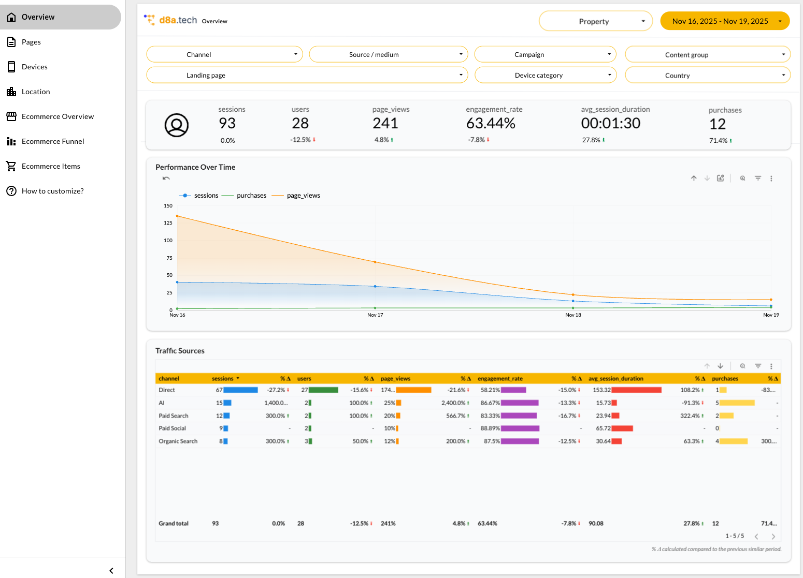
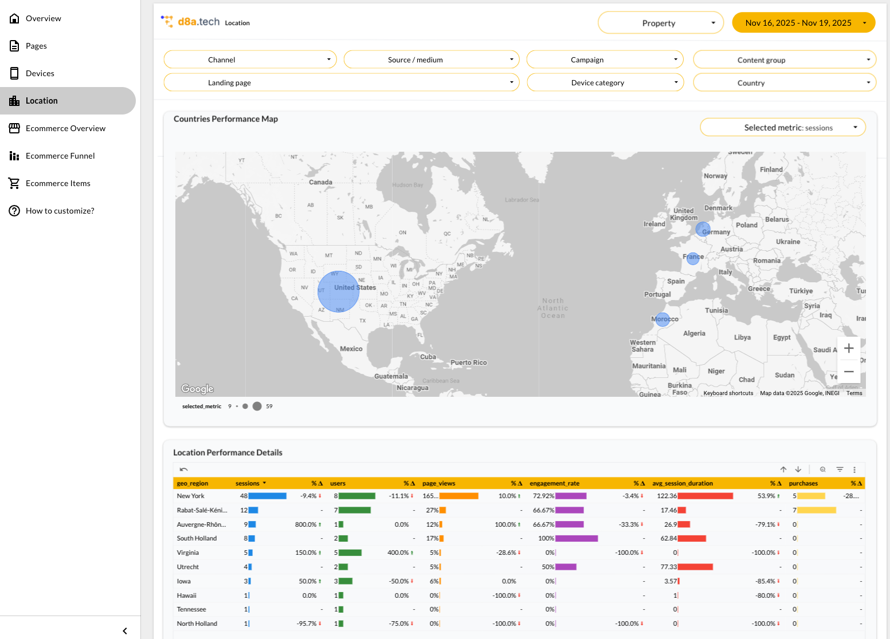
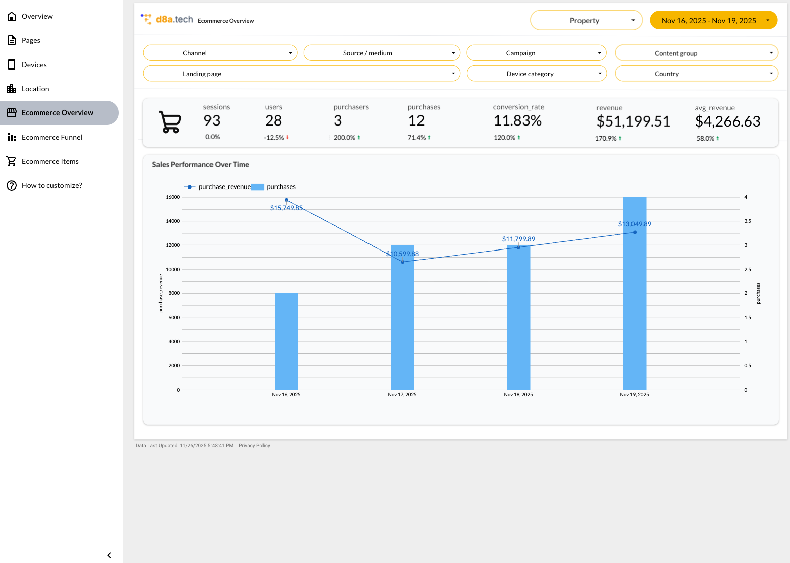

# Divine Data (d8a)

[](LICENSE)
[](https://d8a-tech.github.io/d8a/docs/getting-started)
[](https://github.com/d8a-tech/d8a/issues)

Divine Data (d8a) is an open source clickstream. It uses GA4 tracking protocol, has clean schema, can be deployed anywhere, including your cloud or on-premises. 

## Highlights

- **GA4 tracking protocol compatibility** - Seamlessly integrates with the Google Analytics 4 tracking protocol, allowing you to implement advanced web, server-side, or mobile tracking plans in just minutes
- **Flat data model for visualization** - Data is stored in a flat, analytics-ready format - perfect as a source for reporting and data warehouses, with even custom events stored in dedicated columns
- **Open source codebase** - Transparent, auditable, and community-driven. Fork, contribute, or self-host as you wish
- **Works alongside GA4** - Can run in parallel with GA4 for a smooth transition or as a reliable backup
- **Full session scope support** - Sessions are calculated on the backend for accuracy and flexibility - no reliance on client-side hacks
- **BigQuery & ClickHouse support** - Export and analyze your data in Google BigQuery or ClickHouse for advanced analytics. Scales to billions of events with no upper limit

## Core Use Cases

- **Perfect for healthcare** - Collect traffic on healthcare websites under HIPAA requirements
- **Well-suited for gov** - Collect traffic on gov't websites under FedRAMP requirements
- **Europe & GDPR?** - Supports EU's independence from Bigtech


## Screenshots & Reporting Demo
<table>
  <tr>
    <td>
      <a href="./docs/static/img/reporting-overview.png" target="_blank">
        
      </a>
    </td>
    <td>
      <a href="./docs/static/img/reporting-location.png" target="_blank">
        
      </a>
    </td>
    <td>
      <a href="./docs/static/img/reporting-ecommerce.png" target="_blank">
        
      </a>
    </td>
  </tr>
  <tr>
    <td style="text-align:center;">Overview</td>
    <td style="text-align:center;">Location</td>
    <td style="text-align:center;">Ecommerce</td>
  </tr>
</table>

You can also see the full demo [here](https://lookerstudio.google.com/reporting/e1cca887-5030-48d9-8a3a-40b90b0f84dd).

## Running 

### Production setup (using docker)

See the [Getting started guide](https://docs.d8a.tech/getting-started).

### Development setup (from source)

1. Run it.

```bash
go run main.go server --config config.dev.yaml
```

2. Make a request and wait ~10 seconds for the session to be closed.

```bash
curl "http://localhost:8080/g/collect?v=2&tid=14&dl=https%3A%2F%2Ffoo.bar&en=page_view&cid=ag9" -X POST
```

3. Check the console output to verify events are being processed.


## Testing

```bash
go test ./...
```

## Documentation


See the following resources:

- [Getting Started Guide](https://docs.d8a.tech/getting-started)
- [Database Schema & Columns](https://docs.d8a.tech/articles/database-schema)
- [Technical Deep Dive](https://docs.d8a.tech/articles/technical-deep-dive)

## Join us on Discord

Connect with the team in our Discord community: [link](https://discord.gg/EegbcdsWUc)


## License

MIT — see `LICENSE` for details.

