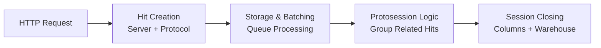
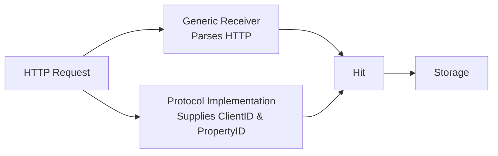
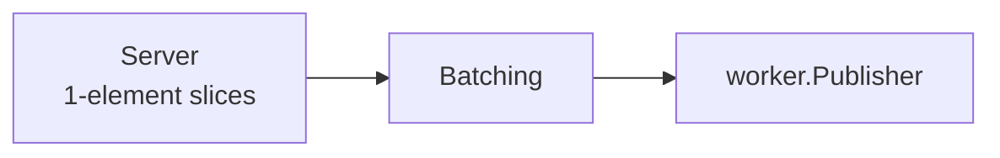
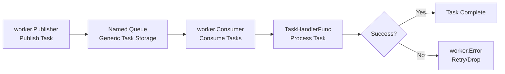
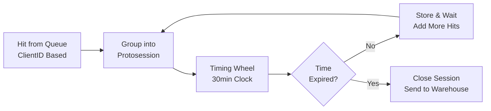
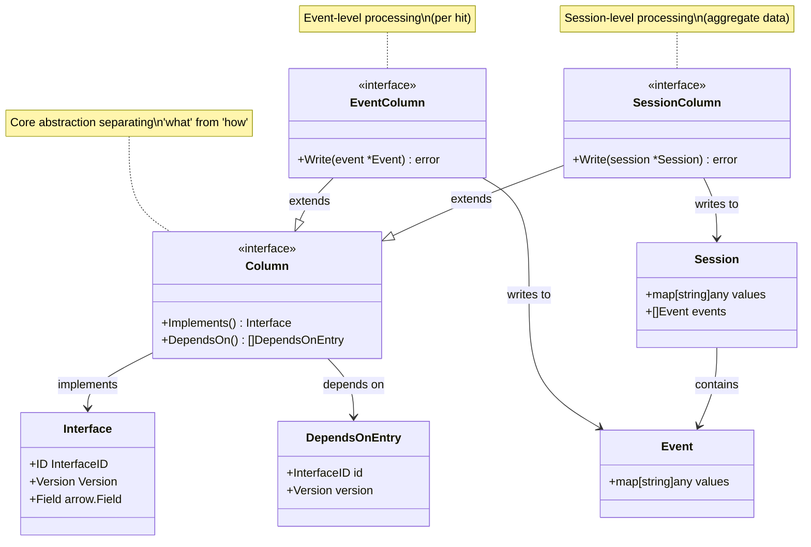

# Technical deep dive

This document briefly describes the abstractions and mechanisms used in d8a tracker. It's suitable as a development resource, can also be consumed by an LLM to get better understanding of the landscape.


## Package layout

Most important packages and abstractions of the tracker project:

- `pkg/receiver` - receives hits from the http endpoint and places them into the message queue as tasks
  - `Storage` - interface for storing a collection of hits, implementations include `receiver.BatchingStorage`, `receiver.dropToStdoutStorage`
- `pkg/transformer` - reads tasks from the queue and transforms the hits into events


Other, utility packages:

- `pkg/cmd` - command line arguments parsing and configuration loading. 
- `pkg/worker` - abstractions for the queue logic
  - `Publisher` - interface for publishing tasks to the queue
  - `Consumer` - interface for consuming tasks from the queue
  - `Task` (struct) - a unit of work with type, headers and data
  - `Worker` (struct) - a worker that can process tasks, accepts a list of handlers and a list of middlewares, receives a single task at a time to be processed
  - `Middleware` (interface) - a middleware for the worker, can be used to modify the task or the result of the task, designed similar to how git middleware is designed
  - `Encoder` and `Decoder` - functions for encoding and decoding task bodies
- `pkg/bolt` - implementations for the queue logic using `etcd/bbolt` package
    - `bolt.Publisher` - a publisher that uses `etcd/bbolt` to store tasks
    - `bolt.Consumer` - a consumer that uses `etcd/bbolt` to load tasks


## The essence




The tracking pipeline, it its essence looks as follows:

1. The HTTP request containing tracked data is received by the `receiver` package. It contains mappings from the HTTP path to specific `protocol.Protocol` implementation (like GA4, Matomo, etc). Protocol helps the `receiver` to create a `hits.Hit` object. It's a very narrow wraper over a http request, containing some additional attributes essential for later processing (`ClientID`, `PropertyID`) and session creation.

2. After a hit is created, it's pushed to implementation of `receiver.Storage` interface. It's a very simple interface, that just accepts a hit and stores it. Under the hood, there's a batcher that buffers hits and pushes them to a generic queue (`worker.Publisher` implementation).

3. On the other side, a `worker.Consumer` implementation reads the tasks, a `worker.TaskHandler` deserializes generic bytes back into `hits.Hit` objects. The protosession logic kicks in.

4. A protosession is a collection of hits, that may form a session in the future. It's perfectly possible, that a collection of hits will be split into multiple sessions. The logic in `protosessions` in essence groups the potentially related hits into a single collection. When a given period of time since the last hit was added to given protosession is reached, the protosession is closed using `protosessions.Closer` imlpementation.

5. In the future we'll have asynchronous closers, that publish ready sessions to queues. Now, we have an in-place closer, that closes the session and immediately writes it to the warehouse. Logic in `session` handles that, specifically `sessions.NewDirectCloser` interface. Session closing executes the columns machinery and writes the session to the warehouse configured for given property. The columns machinery allows defining dependencies between columns, including columns that may be contributed by other parts of the system (for example `core.d8a.tech/events/type` is defined in `columns` package, but as it's not possible to extract event type in a generic way, the implementation is contributed by respective `protocol` implementation).

6. After the columns machinery creates rows for specific tables, it writes it to `warehouse.Driver` implementation. The types of columns are defined in columns machinery using Apache Arrow types, the drivers are resonsible for mapping them to their native types. 

## 1. Hit Creation



Everyting begins in the `receiver` package. It's a HTTP server, that receives requests and creates `hits.Hit` objects. It's currently implemented in `fasthttp`, but it's very loosely coupled to the underlying HTTP server.

The main goal of `receiver` package is to create a `hits.Hit` object from every incoming request and pass it ASAP to some persistent storage, so it won't be lost.

The Hit structure looks something like this:

```go
type Hit struct {	
	ID                 string            `cbor:"i"`
	ClientID           ClientID          `cbor:"ci"`
	PropertyID         string            `cbor:"pi"`

	IP                 string            `cbor:"ip"`
	Host               string            `cbor:"h"`
	ServerReceivedTime string            `cbor:"srt"`
	QueryParams        url.Values        `cbor:"qp"`
	BodyBase64         string            `cbor:"bd"`
  // Other HTTP-related fields
}
```

Basically it wraps all the HTTP request fields with some additional info, usable with next pipeline steps, namely:

* `ClientID`, which is deeply described in [idenifiers](glossary.md). Basically it's a unique, anonymous (by itself) identifier of a client, stored on the client side (for example using cookies) and used to identify the client across multiple requests. The `ClientID` is later used to connect individual hits into proto-sessions and also for partitioning (in d8a cloud).
* `PropertyID`, which is a unique identifier of a property, as GA4 understands it. Other protocols are forced to use GA4 nomenclature, but are free to store the analogous indentifiers in this field (like `Matomo` uses `idSite`). Later pipeline steps configuration, use the `PropertyID` to get the entities, that may be configured for given property, like:
	* table layout (single merged table or separate tables for sessions and events)
	* table columns
	* destination warehouse

The two above are obiosuly protocol-specific, that's why `receiver` delegates the parsing of HTTP request when creating those, to the respective `protocol.Protocol` implementation.

## 2. Receiver Storage & Batching



All the hits in `server` package are batched and pushed to a `receiver.Storage` implementation. 

```go
// Storage is a storage interface for storing hits
type Storage interface {
	Push([]*hits.Hit) error
}
```

In theory it can be any storage, which gives a lot of flexibility in future configurations. Currently, all the passed hits are batched  and pushed to a `worker.Publisher` implementation. This means, that you can have as many `receivers` as you want, but on the other side of the queue (`worker.Consumer`) you'll have only one instance.

## 3. Queue Processing



Queue implemented for `tracker-api` is generic, and can be used in later steps (for example after session is closed and before it's written to the warehouse - currently it's not - for quicker MVP delivery). It's implemented in `worker` package.

The semantics are dead simple - you publish to named queue, that accepts only one type of task, something on the other side consumes it. There are no sophisticated features like AMQP's bindings, exponential backoff and such. Such dead simple approach is limiting, but offers a wide range of possible implementations (currently we have `bolt` implementation, but for sure we'll have more). The interfaces are again very simple. There are two interfaces, that operate on `Task` objects, that are really generic:

```go
// Consumer defines an interface for task consumers
type Consumer interface {
	Consume(handler TaskHandlerFunc) error
}

// TaskHandlerFunc is a function that handles a task
type TaskHandlerFunc func(task *Task) error

// Task represents a unit of work with type, headers and data
type Task struct {
	Type    string
	Headers map[string]string
	Body    []byte
}

// Publisher defines an interface for task publishers that can publish tasks
type Publisher interface {
	Publish(task *Task) error
}
```

And on top of that, there's a `worker.Worker` struct, that helps mapping task types to given queues, using generics - it automatically unmarshalls the task body and passes it to the respective handler with correct type.

```go

w := worker.NewWorker(
	[]worker.TaskHandler{
		worker.NewGenericTaskHandler(
			hits.HitProcessingTaskName,
			encoding.ZlibCBORDecoder,
			func(headers map[string]string, data *hits.Hit) *worker.Error {
				// Process the hit, return specific (retryable or droppable) error
				return nil
			},
		),
	},
	[]worker.Middleware{
		// middleware using the headers, used for partitioning and such
	},
)
```

## 4. Protosession Logic



There's a specific handler for tasks containing `hits.Hit` objects. It's implemented in `protosessions` package - `protosessions.Handler` function creates it. Here we meet the main principle of this design:

:::warning
	Consecutive hits belonging to the same proto sessions **must** be processed by the same worker.
:::

It's connected to how the session closing logic works. For each `ClientID`, the `protosessions.Handler` holds a clock. If 30 minutes (configurable) passed since the last hit was added to the proto-session, the session is closed.

This is implemented using concept loosly based on [timing wheels](https://zbysiu.dev/til/hierarchical-timing-wheels/). Every second a `tick` is emmited, that checks if for given second, any proto-sessions are ready to be closed. More detailed description is in the code itself, in `protosessions/trigger.go` file.

The current implementation doesn't allow a single proto-session to be processed by multiple workers, hence the requirement above. Due to this property, we introduced partitioning in d8a cloud.

The `protesessions` package also handles some dynamic logic via `protosessions.Middleware` interface:

* **Evicting** - a proto-session may be evicted from given worker if the system detects, that it should be connected to another proto-session. This may happen for example if the system detects, that two proto-sessions are coming from the same device (have the same session stamp). This may mean, that user removed cookies or used different browser, and two proto-sessions are preliminarily connected into one.
* **Compaction** - all the information about proto-sessions is stored in simple and generic data-structures - a `storage.Set` and `storage.KV` implementations (currently `bolt`). If a - future - `storage.Set` or `storage.KV` is memory-constrained (for example Redis), it may happen that even in 30-minute window, the system will have too many proto-sessions to process. To avoid that, `protosessions` calculates the size of each proto-session and compacts it if it's too big. Currently the compaction is done in-place, by replacing raw hits with compressed ones in the same `storage.Set`. Newerltheless, the interfaces are already laid in a way, that allows adding layered storage, that would allow for more efficient compaction (for example, storing compressed proto-sessions in a separate `storage.Set` backed by Object Storage).

The closing of protosessions happens by the `protosessions.Closer` interface. 

```go
// Closer defines an interface for closing and processing hit sessions
type Closer interface {
	Close(protosession []*hits.Hit) error
}
```

It's prepared for asynchronous closing, where the task system described in [Queue Processing](#3-queue-processing) is used. Currently, the closing is done in-place, the `Close` method synchronously writes the session to the warehouse. This is not perfect, but it's a good compromise for now.

## 5. Columns Machinery

### 5.1 Columns



Columns machinery is quite complex, it offers the following capabilities:

* Ability to define a column "Interface" (`schema.Interface`), a struct that describes the column: 
	* Column id (to be used in dependency system)
	* Column version (as above)
	* Column name
	* Column type
* Ability to separately define the behavior, that writes data to this column from a given hit.
	* `Write` method
	* Separate interfaces for `Session` and `Event` columns

This decouples the concept of
	* What is the column name and what it stores
	* And how it's written from a given hit

Allowing us to centrally define the core interfaces `columns/core.go` and then implement some them in respective `protocol` implementations.

```go
type Interface struct {
	ID      InterfaceID
	Version Version
	Field   *arrow.Field
}

// Column represents a column with metadata and dependencies.
type Column interface {
	Implements() Interface
	DependsOn() []DependsOnEntry
}

// EventColumn represents a column that can be written to during event processing.
type EventColumn interface {
	Column
	Write(event *Event) error  // Event is a simple struct with map[string]any to write values to
}

// SessionColumn represents a column that can be written to during session processing.
type SessionColumn interface {
	Column
	Write(session *Session) error // As Event, but also has the collection of all the events in the session as a separate field (only for reading)
}

```

It also allows paralell implementations for the same column interface, for example as paid extras (competing geoip implementations - we don't need to select between MaxMind or DbIP - we can use both and let the user decide which one to use).

Most column implementations are in `columns/eventcolumns` and `columns/sessioncolumns` packages, some will be scattered across `protocol` implementations. General interfaces are in `columns` package.

Most of the machinery itself is implemented in `sessions` package, bothe the `Closer` implementation and utilities for combining everything together.

:::warning
	The logic in columns machinery lacks a critical feature - session splitting. Currently it takes all the protosession events and makes them a session. In reality there will be multiple cases, where such protosession should be split into multiple sessions.
:::	

### 5.2 Tables

Tables are also customizable. They're defined using the following concepts:

```go
// Layout is the interface for a table layout, implementations take control over
// the final schema and dictate the format of writing the session data to the table.
type Layout interface {
	Tables(columns Columns) []WithName
	ToRows(columns Columns, sessions ...*Session) ([]TableRows, error)
}

// WithName adds a table name to the schema
type WithName struct {
	Schema *arrow.Schema
	Table  string
}

// TableRows are a collection of rows with a table to write them to
type TableRows struct {
	Table string
	Rows  []map[string]any
}
```

Basically, `Layout` interface tells what tables and with what schema should be created, and `ToRows` method takes the columns and sessions and returns a collection of rows to write to given tables.

This allows for a lot of flexibility, but in practice two approaches will probably ever be used:

* Currently the only implemented one - `schema.NewEmbeddedSessionColumnsLayout` - creates a single table, with all the session columns embedded in the event table, with given prefix.
* To be implemented in the future - a layout for separate tables for sessions and events.

## 6. Warehouse

Most of the logic in `warehouse` package cycles around the following interface:

```go
// Driver abstracts data warehouse operations for table management and data ingestion.
// Implementations handle warehouse-specific DDL/DML operations while maintaining
// compatibility with Apache Arrow schemas.
type Driver interface {
	// CreateTable creates a new table with the specified Arrow schema.
	// Returns error if table exists or schema conversion fails.
	// Implementation must convert Arrow types to warehouse-native types.
	CreateTable(table string, schema *arrow.Schema) error

	// AddColumn adds a new column to an existing table.
	AddColumn(table string, field *arrow.Field) error

	// Write inserts batch data into the specified table.
	// Schema must match table structure. Rows contain column_name -> value mappings.
	// Implementation handles type conversion and batch optimization.
	// Returns error on type mismatch, constraint violation, or connection issues.
	Write(table string, schema *arrow.Schema, rows []map[string]any) error

	// MissingColumns compares provided schema against existing table structure.
	// Returns fields that exist in schema but not in table.
	// Used for schema drift detection before writes.
	// Returns TableNotFoundError if table doesn't exist.
	MissingColumns(table string, schema *arrow.Schema) ([]*arrow.Field, error)
}
```

:::danger
	Work in progress
:::