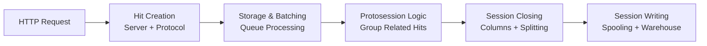
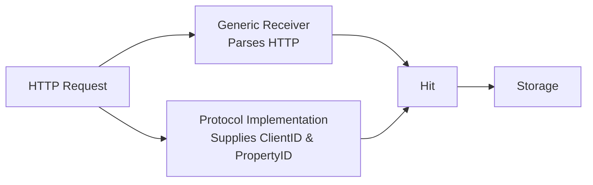
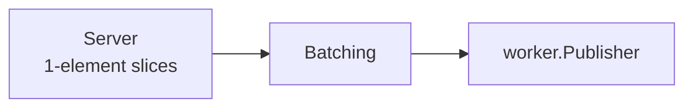
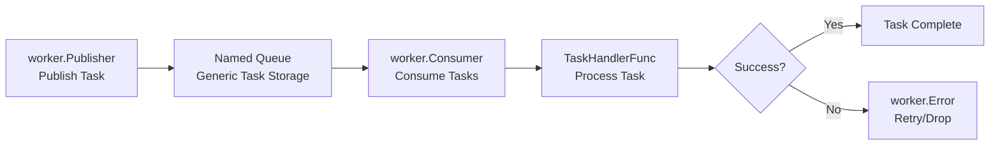
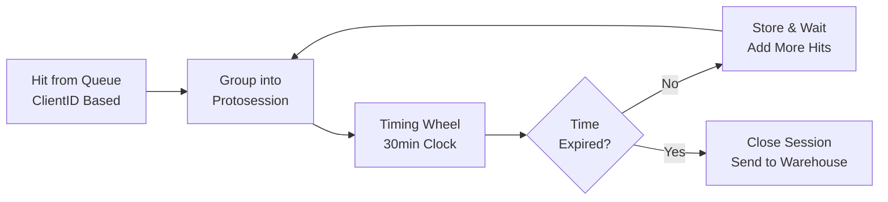
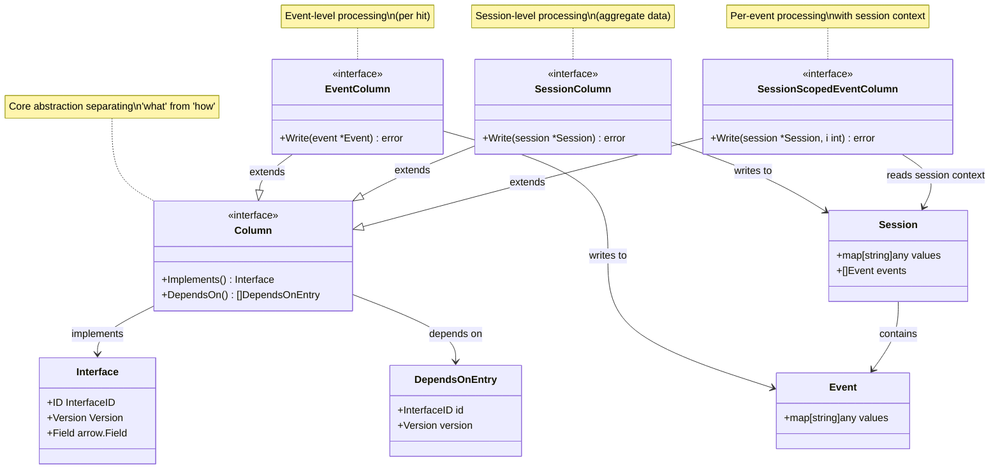
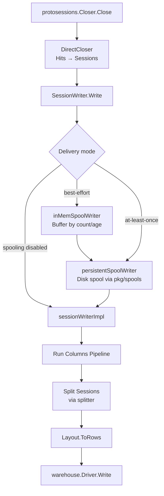
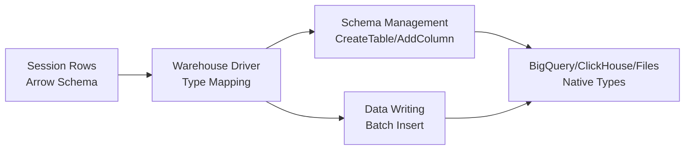

# Technical deep dive

This document briefly describes the abstractions and mechanisms used in d8a tracker. It's suitable as a development resource, can also be consumed by an LLM to get better understanding of the landscape.


## Package layout

Most important packages and abstractions of the tracker project:

- `pkg/receiver` - receives hits from the HTTP endpoint and places them into the message queue as tasks
- `pkg/protosessions` - reads tasks from the queue and groups hits into proto-sessions, then closes them into sessions
- `pkg/sessions` - handles session closing, column processing, spooling, and writing to the warehouse
- `pkg/columns` and `pkg/schema` - column definitions (interfaces) and column implementations (how values are computed and written)
- `pkg/warehouse` - provides abstractions for writing data to various data warehouses
- `pkg/splitter` - splits and filters sessions based on configurable conditions (UTM change, user ID change, max events, time limit)
- `pkg/spools` - crash-safe keyed framed-file append+flush primitive used for persistent session spooling

Other, utility packages:

- `pkg/cmd` - command line arguments parsing, configuration loading, and full pipeline wiring
- `pkg/worker` - abstractions for the queue logic (publisher, consumer, task, worker, middleware)
- `pkg/bolt` - BoltDB-backed implementations for KV, set, and proto-session I/O primitives
- `pkg/storage` - generic KV and set storage interfaces with in-memory and monitoring implementations
- `pkg/protocol` - tracking protocol abstractions and implementations (GA4, Matomo, D8A)
- `pkg/properties` - property settings registry and configuration
- `pkg/hits` - core `Hit` data structure representing a single tracking request
- `pkg/encoding` - pluggable encoder/decoder function pairs (CBOR+zlib, JSON, gzip+JSON, gob)
- `pkg/storagepublisher` - thin adapter that serializes a batch of hits into a worker task and publishes it


## The essence



```mermaid
flowchart LR
    A[HTTP Request] --> B[Hit Creation<br/>Server + Protocol]
    B --> C[Storage & Batching<br/>Queue Processing]
    C --> D[Protosession Logic<br/>Group Related Hits]
    D --> E[Session Closing<br/>Columns + Splitting]
    E --> F[Session Writing<br/>Spooling + Warehouse]
```

The tracking pipeline, in its essence looks as follows:

1. The HTTP request containing tracked data is received by the `receiver` package. It contains mappings from the HTTP path to specific `protocol.Protocol` implementation (like GA4, Matomo, etc). Protocol helps the `receiver` to create a `hits.Hit` object. It's a very narrow wrapper over a http request, containing some additional attributes essential for later processing (`ClientID`, `PropertyID`) and session creation.

2. After a hit is created, it's pushed to implementation of `receiver.Storage` interface. It's a very simple interface, that just accepts a hit and stores it. Under the hood, there's a batcher that buffers hits and pushes them to a generic queue (`worker.Publisher` implementation).

3. On the other side, a `worker.Consumer` implementation reads the tasks, a `worker.TaskHandler` deserializes generic bytes back into `hits.Hit` objects. The protosession logic kicks in.

4. A protosession is a collection of hits, that may form a session in the future. It's perfectly possible, that a collection of hits will be split into multiple sessions. The logic in `protosessions` in essence groups the potentially related hits into a single collection. When a given period of time since the last hit was added to given protosession is reached, the protosession is closed using `protosessions.Closer` implementation.

5. The `sessions` package handles closing. `DirectCloser` converts proto-sessions (groups of `*hits.Hit`) into `schema.Session` objects and delegates to a `SessionWriter`. The writer runs the columns machinery, splits sessions via the `splitter` package, converts results to rows via a `Layout`, and writes them to the warehouse. The writer may be decorated with spooling layers (`inMemSpoolWriter` for in-memory buffering, `persistentSpoolWriter` for crash-safe disk spooling via `pkg/spools`) before the actual warehouse write.

6. After the columns machinery creates rows for specific tables, it writes them to `warehouse.Driver` implementation. The types of columns are defined in columns machinery using Apache Arrow types, the drivers are responsible for mapping them to their native types.

## 1. Hit creation


```mermaid
flowchart LR
    A[HTTP Request] --> B[Generic Receiver<br/>Parses HTTP]
    A --> C[Protocol Implementation<br/>Supplies ClientID & PropertyID]
    B --> D[Hit]
    C --> D
    D --> E[Storage]
```

Everything begins in the `receiver` package. It's a HTTP server, that receives requests and creates `hits.Hit` objects. It's currently implemented in `fasthttp`, but it's very loosely coupled to the underlying HTTP server.

The main goal of `receiver` package is to create a `hits.Hit` object from every incoming request and pass it ASAP to some persistent storage, so it won't be lost.

The Hit structure looks something like this:

```go
type Hit struct {	
	ID                 string            `cbor:"i"`
	ClientID           ClientID          `cbor:"ci"`
	PropertyID         string            `cbor:"pi"`

	IP                 string            `cbor:"ip"`
	Host               string            `cbor:"h"`
	ServerReceivedTime string            `cbor:"srt"`
	QueryParams        url.Values        `cbor:"qp"`
	BodyBase64         string            `cbor:"bd"`
  // Other HTTP-related fields
}
```

Basically it wraps all the HTTP request fields with some additional info, usable with next pipeline steps, namely:

* `ClientID`, which is deeply described in [identifiers](glossary.md). Basically it's a unique, anonymous (by itself) identifier of a client, stored on the client side (for example using cookies) and used to identify the client across multiple requests. The `ClientID` is later used to connect individual hits into proto-sessions and also for partitioning (in d8a cloud).
* `PropertyID`, which is a unique identifier of a property, as GA4 understands it. Other protocols are forced to use GA4 nomenclature, but are free to store the analogous identifiers in this field (like `Matomo` uses `idSite`). Later pipeline steps configuration, use the `PropertyID` to get the entities, that may be configured for given property, like:
	* table layout (single merged table or separate tables for sessions and events)
	* table columns
	* destination warehouse

The two above are obviously protocol-specific, that's why `receiver` delegates the parsing of HTTP request when creating those, to the respective `protocol.Protocol` implementation.

### Key interfaces

**`protocol.Protocol`** - defines a tracking protocol implementation (GA4, Matomo, D8A). Parses HTTP requests into hits, provides protocol-specific columns and endpoints.
- `ga4Protocol` - GA4-compatible protocol that parses Google Analytics 4 Measurement Protocol requests
- `matomoProtocol` - Matomo/Piwik protocol that parses single and bulk tracking requests
- `d8aProtocol` - D8A native protocol wrapping GA4 with rewritten endpoints and interface IDs

**`protocol.Registry`** - resolves the appropriate `Protocol` for a given property ID.
- `staticProtocolRegistry` - map-based registry with a default protocol fallback

**`protocol.PropertyIDExtractor`** - extracts property ID from a parsed request.
- `fromTidByMeasurementIDExtractor` - extracts from GA4 `tid` query parameter
- `fromIDSiteExtractor` - extracts from Matomo `idsite` query parameter

**`receiver.HitValidatingRule`** - validation strategy for incoming hits; rules are composable.
- `multipleHitValidatingRule` - composite rule that runs all child rules and joins errors
- `simpleHitValidatingRule` - wraps a plain function as a validation rule
- Pre-built rules: `ClientIDNotEmpty`, `PropertyIDNotEmpty`, `HitHeadersNotEmpty`, `EventNameNotEmpty`, `TotalHitSizeDoesNotExceed(max)`, etc.

**`receiver.RawLogStorage`** - optional side-channel for storing raw requests before hit conversion (debugging/auditing).
- `NoopRawLogStorage` - discards all data

**`properties.SettingsRegistry`** - looks up property configuration by measurement ID or property ID.
- `StaticSettingsRegistry` - static in-memory registry backed by two maps with optional default fallback

## 2. Receiver storage & batching


```mermaid
flowchart LR
    A[Server<br/>1-element slices] --> B[Batching]
    B --> C[worker.Publisher]
```

All the hits in `server` package are batched and pushed to a `receiver.Storage` implementation. 

```go
// Storage is a storage interface for storing hits
type Storage interface {
	Push([]*hits.Hit) error
}
```

In theory it can be any storage, which gives a lot of flexibility in future configurations. Currently, all the passed hits are batched  and pushed to a `worker.Publisher` implementation. This means, that you can have as many `receivers` as you want, but on the other side of the queue (`worker.Consumer`) you'll have only one instance.

### Key interfaces

**`receiver.Storage`** - core abstraction for persisting/forwarding hits after they are received.
- `BatchingStorage` - accumulates hits in a `BatchingBackend` and flushes to a child `Storage` on batch-size or timeout threshold
- `storagepublisher.Adapter` - serializes hits into a `worker.Task` and publishes them via `worker.Publisher` (production child storage)
- `dropToStdoutStorage` - writes each hit as pretty-printed JSON to stdout (debug)

**`receiver.BatchingBackend`** - pluggable persistence layer for staging hits between arrival and flush.
- `memoryBatchingBackend` - in-memory slice, clears after flush (default)
- `fileBatchingBackend` - durable staging to disk using an append-only framed-JSON file

## 3. Queue processing


```mermaid
flowchart LR
    A[worker.Publisher<br/>Publish Task] --> B[Named Queue<br/>Generic Task Storage]
    B --> C[worker.Consumer<br/>Consume Tasks]
    C --> D[TaskHandlerFunc<br/>Process Task]
    D --> E{Success?}
    E -->|Yes| F[Task Complete]
    E -->|No| G[worker.Error<br/>Retry/Drop]
```

Queue implemented for `tracker-api` is generic, and can be used in later steps (for example after session is closed and before it's written to the warehouse - currently it's not - for quicker MVP delivery). It's implemented in `worker` package.

The semantics are dead simple - you publish to named queue, that accepts only one type of task, something on the other side consumes it. There are no sophisticated features like AMQP's bindings, exponential backoff and such. Such dead simple approach is limiting, but offers a wide range of possible implementations (currently we have filesystem and object storage implementations). The interfaces are again very simple. There are two interfaces, that operate on `Task` objects, that are really generic:

```go
// Consumer defines an interface for task consumers
type Consumer interface {
	Consume(handler TaskHandlerFunc) error
}

// TaskHandlerFunc is a function that handles a task
type TaskHandlerFunc func(task *Task) error

// Task represents a unit of work with type, headers and data
type Task struct {
	Type    string
	Headers map[string]string
	Body    []byte
}

// Publisher defines an interface for task publishers that can publish tasks
type Publisher interface {
	Publish(task *Task) error
}
```

And on top of that, there's a `worker.Worker` struct, that helps mapping task types to given queues, using generics - it automatically unmarshalls the task body and passes it to the respective handler with correct type.

```go

w := worker.NewWorker(
	[]worker.TaskHandler{
		worker.NewGenericTaskHandler(
			hits.HitProcessingTaskName,
			encoding.ZlibCBORDecoder,
			func(headers map[string]string, data *hits.Hit) *worker.Error {
				// Process the hit, return specific (retryable or droppable) error
				return nil
			},
		),
	},
	[]worker.Middleware{
		// middleware using the headers, used for partitioning and such
	},
)
```

### Key interfaces

**`worker.Publisher`** - publishes a single task to a queue.
- `FilesystemDirectoryPublisher` - writes tasks atomically to timestamped `.task` files in a directory
- `objectstorage.Publisher` - uploads serialized tasks to an object storage bucket via Go CDK
- `monitoringPublisher` - decorator that records OpenTelemetry metrics, then delegates

**`worker.Consumer`** - consumes tasks from a queue via a handler callback.
- `FilesystemDirectoryConsumer` - polls a directory for `.task` files, processes in timestamp order
- `objectstorage.Consumer` - polls an object storage bucket for task objects via Go CDK

**`worker.Middleware`** - wraps task processing with a next-chain pattern (similar to HTTP middleware).
- No production implementations in core packages currently

**`worker.TaskHandler`** - handler for a specific task type.
- `genericTaskHandler[T]` - type-parameterized handler that decodes the body into `T` and calls a typed processor

**`worker.MessageFormat`** - serialization/deserialization of `*Task` to/from `[]byte`.
- `binaryMessageFormat` - binary wire format with type-length prefix, JSON-encoded headers, and raw body

## 4. Protosession logic


```mermaid
flowchart LR
    A[Hit from Queue<br/>ClientID Based] --> B[Group into<br/>Protosession]
    B --> C[Timing Wheel<br/>30min Clock]
    C --> D{Time<br/>Expired?}
    D -->|No| E[Store & Wait<br/>Add More Hits]
    D -->|Yes| F[Close Session<br/>Send to Warehouse]
    E --> B
```

There's a specific handler for tasks containing `hits.Hit` objects. It's implemented in `protosessions` package - `protosessions.Handler` function creates it. Here we meet the main principle of this design:

:::warning
	Consecutive hits belonging to the same proto sessions **must** be processed by the same worker.
:::

It's connected to how the session closing logic works. For each `ClientID`, the `protosessions.Handler` holds a clock. If 30 minutes (configurable) passed since the last hit was added to the proto-session, the session is closed.

This is implemented using concept loosely based on [timing wheels](https://zbysiu.dev/til/hierarchical-timing-wheels/). Every second a `tick` is emitted, that checks if for given second, any proto-sessions are ready to be closed. More detailed description is in the code itself, in `protosessions/trigger.go` file.

The current implementation doesn't allow a single proto-session to be processed by multiple workers, hence the requirement above. Due to this property, we introduced partitioning in d8a cloud.

The `protosessions` package also handles some dynamic logic via `protosessions.Middleware` interface:

* **Evicting** - a proto-session may be evicted from given worker if the system detects, that it should be connected to another proto-session. This may happen for example if the system detects, that two proto-sessions are coming from the same device (have the same session stamp). This may mean, that user removed cookies or used different browser, and two proto-sessions are preliminarily connected into one.
* **Compaction** - all the information about proto-sessions is stored in simple and generic data-structures - a `storage.Set` and `storage.KV` implementations (currently `bolt`). If a - future - `storage.Set` or `storage.KV` is memory-constrained (for example Redis), it may happen that even in 30-minute window, the system will have too many proto-sessions to process. To avoid that, `protosessions` calculates the size of each proto-session and compacts it if it's too big. Currently the compaction is done in-place, by replacing raw hits with compressed ones in the same `storage.Set`. Nevertheless, the interfaces are already laid in a way, that allows adding layered storage, that would allow for more efficient compaction (for example, storing compressed proto-sessions in a separate `storage.Set` backed by Object Storage).

The closing of protosessions happens by the `protosessions.Closer` interface. 

```go
// Closer defines an interface for closing and processing hit sessions
type Closer interface {
	Close(protosession [][]*hits.Hit) error
}
```

It's prepared for asynchronous closing, where the task system described in [Queue Processing](#3-queue-processing) is used. Currently, the closing is done in-place, the `Close` method synchronously writes the session to the warehouse. This is not perfect, but it's a good compromise for now.

### Key interfaces

**`protosessions.Closer`** - processes and closes proto-sessions (groups of hits that form a session).
- `shardingCloser` - distributes batches of proto-sessions across N child closers using FNV hash-based sharding on isolated client ID
- `sessions.DirectCloser` - converts proto-sessions into `schema.Session` objects, groups by property, and writes them to a `SessionWriter` (production closer)
- `printingCloser` - logs each hit to stdout for debugging

**`protosessions.BatchedIOBackend`** - batched I/O for proto-session storage (identifier conflict detection, hit append/get, timing-wheel bucket marking, cleanup).
- `bolt.boltBatchedIOBackend` - BoltDB-backed backend with in-memory session-to-bucket cache; all operations run in single transactions
- `deduplicatingBatchedIOBackend` - decorator that deduplicates identical requests before forwarding

**`protosessions.TimingWheelStateBackend`** - persistence for the timing wheel's cursor position.
- `genericKVTimingWheelBackend` - stores bucket state in a `storage.KV` under a prefixed key

**`protosessions.IdentifierIsolationGuardFactory`** / **`IdentifierIsolationGuard`** - ensures cross-property data isolation by hashing client IDs with property ID.
- `defaultIdentifierIsolationFactory` / `defaultIdentifierIsolationGuard` - SHA-256 hashes client IDs with property ID for isolation
- `noIsolationFactory` / `noIsolationGuard` - returns IDs as-is, no isolation (single-tenant only)

**`storage.KV`** - simple key-value store abstraction.
- `bolt.boltKV` - BoltDB-backed persistent KV store
- `storage.InMemoryKV` - in-memory map-based KV with RWMutex
- `monitoringKV` - decorator that records OpenTelemetry latency histograms

**`storage.Set`** - set-of-values-per-key storage.
- `bolt.boltSet` - BoltDB-backed persistent set using nested buckets
- `storage.InMemorySet` - in-memory map-of-sets
- `monitoringSet` - decorator that records OpenTelemetry latency histograms

### 4.1 Isolation

The isolation mechanism ensures that proto-sessions from different properties are kept separate, even when they share the same client identifiers. Without isolation, users from different properties, under some conditions, could have their hits incorrectly grouped into a single proto-session.

The isolation is implemented through the `IdentifierIsolationGuard` interface, which provides three key capabilities:

```go
type IdentifierIsolationGuardFactory interface {
	New(settings *properties.Settings) IdentifierIsolationGuard
}

type IdentifierIsolationGuard interface {
	IsolatedClientID(hit *hits.Hit) hits.ClientID
	IsolatedSessionStamp(hit *hits.Hit) string
	IsolatedUserID(hit *hits.Hit) string
}
```

The `IsolatedClientID` method transforms the `AuthoritativeClientID` used for storage keys, ensuring that the same client ID from different properties results in different isolated identifiers. The default implementation hashes the property ID together with the Client ID.

The `IsolatedSessionStamp` method produces property-scoped session stamps, `IsolatedUserID` similar, but for user ID.


## 5. Columns machinery

### 5.1 Columns


```mermaid
classDiagram
    class Interface {
        +ID InterfaceID
        +Version Version
        +Field arrow.Field
    }
    
    class Column {
        <<interface>>
        +Implements() Interface
        +DependsOn() []DependsOnEntry
    }
    
    class EventColumn {
        <<interface>>
        +Write(event *Event) error
    }
    
    class SessionColumn {
        <<interface>>
        +Write(session *Session) error
    }
    
    class SessionScopedEventColumn {
        <<interface>>
        +Write(session *Session, i int) error
    }
    
    class Event {
        +map[string]any values
    }
    
    class Session {
        +map[string]any values
        +[]Event events
    }
    
    class DependsOnEntry {
        +InterfaceID id
        +Version version
    }
    
    Column --> Interface : implements
    Column --> DependsOnEntry : depends on
    EventColumn --|> Column : extends
    SessionColumn --|> Column : extends
    SessionScopedEventColumn --|> Column : extends
    EventColumn --> Event : writes to
    SessionColumn --> Session : writes to
    SessionScopedEventColumn --> Session : reads session context
    Session --> Event : contains
    
    note for Column "Core abstraction separating\n'what' from 'how'"
    note for EventColumn "Event-level processing\n(per hit)"
    note for SessionColumn "Session-level processing\n(aggregate data)"
    note for SessionScopedEventColumn "Per-event processing\nwith session context"
```

Columns machinery is quite complex, it offers the following capabilities:

* Ability to define a column "Interface" (`schema.Interface`), a struct that describes the column: 
	* Column id (to be used in dependency system)
	* Column version (as above)
	* Column name
	* Column type
* Ability to separately define the behavior, that writes data to this column from a given hit.
	* `Write` method
	* Separate interfaces for `Event`, `Session`, and `SessionScopedEvent` columns

This decouples the concept of
	* What is the column name and what it stores
	* And how it's written from a given hit

Allowing us to centrally define the core interfaces `columns/core.go` and then implement some them in respective `protocol` implementations.

```go
type Interface struct {
	ID      InterfaceID
	Version Version
	Field   *arrow.Field
}

// Column represents a column with metadata and dependencies.
type Column interface {
	Implements() Interface
	DependsOn() []DependsOnEntry
}

// EventColumn represents a column that can be written to during event processing.
type EventColumn interface {
	Column
	Write(event *Event) error  // Event is a simple struct with map[string]any to write values to
}

// SessionColumn represents a column that can be written to during session processing.
type SessionColumn interface {
	Column
	Write(session *Session) error // As Event, but also has the collection of all the events in the session as a separate field (only for reading)
}

// SessionScopedEventColumn represents a column that writes per-event values with session-wide context.
type SessionScopedEventColumn interface {
	Column
	Write(session *Session, i int) error // Takes the session and event index
}

```

It also allows parallel implementations for the same column interface, for example as paid extras (competing geoip implementations - we don't need to select between MaxMind or DbIP - we can use both and let the user decide which one to use).

Most column implementations are in `columns/eventcolumns` and `columns/sessioncolumns` packages, some will be scattered across `protocol` implementations. General interfaces are in `columns` package.

Most of the machinery itself is implemented in `sessions` package, both the `Closer` implementation and utilities for combining everything together.

### Key interfaces

**`schema.Column`** (base) / **`schema.EventColumn`** / **`schema.SessionColumn`** / **`schema.SessionScopedEventColumn`** - the three column types.
- `simpleEventColumn` - generic event column; constructed via `NewSimpleEventColumn`, `FromQueryParamEventColumn`, `URLElementColumn`, `AlwaysNilEventColumn`, etc.
- `simpleSessionColumn` - generic session column; constructed via `NewSimpleSessionColumn`, `FromQueryParamSessionColumn`, `NthEventMatchingPredicateValueColumn`, etc.
- `simpleSessionScopedEventColumn` - generic session-scoped event column; constructed via `NewSimpleSessionScopedEventColumn`, `NewValueTransitionColumn`, `NewFirstLastMatchingEventColumn`, etc.

**`schema.ColumnsRegistry`** - resolves the full set of columns for a given property ID.
- `staticColumnsRegistry` - maps property IDs to columns with a default fallback
- `merger` - merges multiple `ColumnsRegistry` instances and topologically sorts the result

**`schema.OrderKeeper`** - determines output column ordering for stable Arrow schemas.
- `InterfaceOrdering` - derives order from Go struct field positions
- `noParticicularOrderKeeper` - assigns order in first-seen order (for testing)

**`schema.D8AColumnWriteError`** - error interface for column write operations with retryability semantics.
- `BrokenSessionError` - non-retryable, marks the session as broken
- `BrokenEventError` - non-retryable, marks the event as broken
- `RetryableError` - retryable, the pipeline retries the whole batch

**Notable pre-built columns:**
- Event: `EventIDColumn`, `EventNameColumn`, `ClientIDColumn`, `UserIDColumn`, `IPAddressColumn`, UTM columns, click ID columns, device columns (dd2-based)
- Session: `SessionIDColumn`, `DurationColumn`, `TotalEventsColumn`, `ReferrerColumn`, `SplitCauseColumn`, source/medium/term columns
- Session-scoped event: `SSESessionHitNumber`, `SSESessionPageNumber`, `SSETrafficFilterName`

**`columns.SourceMediumTermDetector`** - detects session source, medium, and term from events.
- `compositeSourceMediumTermDetector` - runs a chain of child detectors in priority order
- `directSourceMediumTermDetector` - returns `(direct) / none` when no referrer
- `pageLocationParamsDetector` - detects from URL query params (gclid, fbclid, etc.)
- `searchEngineDetector` - matches referrer against search engine database
- `socialsDetector` - matches referrer against social networks database
- `aiDetector` - matches referrer against AI tools database
- `videoDetector` - matches referrer against video sites database
- `emailDetector` - matches referrer against email provider database
- `genericReferralDetector` - fallback: any referrer hostname becomes `source=hostname / medium=referral`

### 5.2 Tables

Tables are also customizable. They're defined using the following concepts:

```go
// Layout is the interface for a table layout, implementations take control over
// the final schema and dictate the format of writing the session data to the table.
type Layout interface {
	Tables(columns Columns) []WithName
	ToRows(columns Columns, sessions ...*Session) ([]TableRows, error)
}

// WithName adds a table name to the schema
type WithName struct {
	Schema *arrow.Schema
	Table  string
}

// TableRows are a collection of rows with a table to write them to
type TableRows struct {
	Table string
	Rows  []map[string]any
}
```

Basically, `Layout` interface tells what tables and with what schema should be created, and `ToRows` method takes the columns and sessions and returns a collection of rows to write to given tables.

**`schema.Layout`** - controls final schema and dictates the format of writing session data to tables.
- `eventsWithEmbeddedSessionColumnsLayout` - single-table layout that embeds session columns into the events table with a configurable prefix
- `batchingLayout` - decorator that merges rows from the same table into a single batch entry
- `brokenFilteringLayout` - decorator that filters out broken sessions and events before writing

**`schema.LayoutRegistry`** - resolves a `Layout` for a given property ID.
- `staticLayoutRegistry` - maps property IDs to layouts with a default fallback

## 6. Session closing and writing


```mermaid
flowchart TB
    A[protosessions.Closer.Close] --> B[DirectCloser<br/>Hits → Sessions]
    B --> C[SessionWriter.Write]
    C --> D{Delivery mode}
    D -->|best-effort| E[inMemSpoolWriter<br/>Buffer by count/age]
    E --> F[persistentSpoolWriter<br/>Disk spool via pkg/spools]
    D -->|at-least-once| F
    D -->|spooling disabled| G[sessionWriterImpl]
    F --> G
    G --> H[Run Columns Pipeline]
    H --> I[Split Sessions<br/>via splitter]
    I --> J[Layout.ToRows]
    J --> K[warehouse.Driver.Write]
```

When a protosession is closed, the `sessions.DirectCloser` converts proto-sessions (groups of `*hits.Hit`) into `*schema.Session` objects, groups them by property, and delegates to a `SessionWriter`.

The `SessionWriter` is assembled as a decorator chain whose shape depends on the delivery mode:

- **Best-effort (default):** `inMemSpoolWriter` → `persistentSpoolWriter` → `sessionWriterImpl`
- **At-least-once:** `persistentSpoolWriter` → `sessionWriterImpl` (no in-memory buffer; sessions go straight to disk spool)
- **Spooling disabled:** `sessionWriterImpl` directly

The spooling decorators provide resilience:

1. **`inMemSpoolWriter`** - buffers sessions in memory per property and flushes to its child writer when a count threshold (`maxSessions`) or age threshold (`maxAge`) is reached. A background goroutine sweeps periodically. On flush failure, sessions are retained in the buffer for retry.

2. **`persistentSpoolWriter`** - encodes sessions via `encoding.EncoderFunc` (Gob by default), appends to a crash-safe `spools.Spool` keyed by property, and periodically flushes via a background actor loop that decodes and delegates to the child writer. Failure handling (max consecutive failures, delete vs. quarantine strategy) is configured on the underlying `spools.Spool`, not on the writer itself.

The core `sessionWriterImpl` then:
1. Resolves warehouse driver, layout, and columns per property (cached with TTL)
2. Runs event columns (`EventColumn.Write`) for each event
3. Splits sessions via the `splitter` package
4. Runs session-scoped event columns (`SessionScopedEventColumn.Write`) for each event in context
5. Runs session columns (`SessionColumn.Write`) for each session
6. Converts to rows via `Layout.ToRows`
7. Writes rows to each table in parallel via `warehouse.Driver`

### Key interfaces

**`sessions.SessionWriter`** - core interface for writing closed sessions through the column pipeline to the warehouse.
- `sessionWriterImpl` - the main writer: resolves layout/columns/warehouse per property, runs columns, splits, converts to rows, writes to warehouse
- `inMemSpoolWriter` - decorator that buffers sessions in memory and flushes on count/age thresholds
- `persistentSpoolWriter` - decorator that encodes sessions to disk spool and flushes periodically
- `noopWriter` - does nothing (testing)

**`spools.FailureStrategy`** - defines behavior when a spool file exceeds maximum consecutive failures. Configured on the `spools.Spool` via `spools.WithFailureStrategy()`.
- `spools.deleteStrategy` - deletes the spool file (best-effort, data loss acceptable)
- `spools.quarantineStrategy` - renames spool file to `.quarantine` suffix (preserves for manual recovery)

**`spools.Spool`** - crash-safe keyed framed-file append+flush primitive.
- `fileSpool` - `afero.Fs`-backed implementation using length-prefixed binary frames, rename-before-read flush isolation, and mutex-protected concurrent access

**`splitter.SessionModifier`** - takes a session and returns zero or more split/filtered sessions.
- `splitterImpl` - core splitter that evaluates a list of `Condition`s sequentially against events
- `filterModifier` - filters events from a session using compiled expr-lang expressions
- `MultiModifier` - chains multiple modifiers, feeding output of one into the next

**`splitter.Condition`** - decides whether a session should be split at a given event.
- `nullableStringColumnValueChangedCondition` - splits when a nullable-string column value changes (UTM, user ID)
- `maxXEventsCondition` - splits when event count exceeds a threshold
- `timeSinceFirstEventCondition` - splits when elapsed time since first event exceeds a duration

**`splitter.Registry`** - provides a `SessionModifier` for a given property ID.
- `fromPropertySettingsRegistry` - builds a modifier from property settings (conditions + optional filter)
- `cachingRegistry` - wraps another registry with a ristretto TTL cache
- `staticRegistry` - always returns the same modifier regardless of property

## 7. Warehouse


```mermaid
flowchart LR
    A[Session Rows<br/>Arrow Schema] --> B[Warehouse Driver<br/>Type Mapping]
    B --> C[Schema Management<br/>CreateTable/AddColumn]
    B --> D[Data Writing<br/>Batch Insert]
    C --> E[BigQuery/ClickHouse/Files<br/>Native Types]
    D --> E
```

The `warehouse` package provides a unified interface for writing session data to various data warehouses. It abstracts away warehouse-specific details while maintaining compatibility with Apache Arrow schemas used throughout the columns machinery.

### 7.1 Driver interface

The core abstraction is the `Driver` interface, which defines operations for table management and data ingestion:

```go
// Driver abstracts data warehouse operations for table management and data ingestion.
// Implementations handle warehouse-specific DDL/DML operations while maintaining
// compatibility with Apache Arrow schemas.
type Driver interface {
	// CreateTable creates a new table with the specified Arrow schema.
	CreateTable(table string, schema *arrow.Schema) error

	// AddColumn adds a new column to an existing table.
	AddColumn(table string, field *arrow.Field) error

	// Write inserts batch data into the specified table.
	Write(ctx context.Context, table string, schema *arrow.Schema, rows []map[string]any) error

	// MissingColumns compares provided schema against existing table structure.
	MissingColumns(table string, schema *arrow.Schema) ([]*arrow.Field, error)

	// Close releases resources held by the driver.
	Close() error
}
```

The `Write` method accepts rows as `[]map[string]any`, where each map represents a row with column names as keys. This format is produced by the `Layout.ToRows` method from the columns machinery.

### 7.2 Type mapping

Warehouse drivers must convert between Apache Arrow types and warehouse-native types. This is handled through the `FieldTypeMapper` interface:

```go
// FieldTypeMapper provides bidirectional conversion between Arrow types and warehouse-specific types.
type FieldTypeMapper[WHT SpecificWarehouseType] interface {
	ArrowToWarehouse(arrowType ArrowType) (WHT, error)
	WarehouseToArrow(warehouseType WHT) (ArrowType, error)
}
```

Each relevant warehouse driver implementation (BigQuery, ClickHouse) provides its own type mapper that handles:
- Primitive types (integers, floats, strings, booleans)
- Complex types (timestamps, dates, arrays, structs)
- Nullability handling
- Type-specific formatting for data insertion

The type mapping system also supports compatibility rules, allowing certain type conversions (e.g., INT32 ↔ INT64) to be considered valid during schema comparisons.

### 7.3 Schema management

Drivers handle schema evolution through three main operations:

1. **CreateTable** - Creates a new table with the specified Arrow schema. The driver converts Arrow field definitions to warehouse-specific DDL statements. For SQL-based warehouses, this uses the `QueryMapper` interface to generate CREATE TABLE statements.

2. **AddColumn** - Adds a new column to an existing table. Before adding, the driver checks if the column already exists to avoid errors. This enables schema evolution as new columns are added to the column definitions.

3. **MissingColumns** - Detects schema drift by comparing the expected schema (from column definitions) with the actual table schema. This is used before writes to automatically add missing columns. The method also performs type compatibility checking to ensure existing columns match expected types.

The `FindMissingColumns` function provides common logic for comparing schemas, handling both missing columns and type incompatibilities. It uses a `FieldCompatibilityChecker` to determine if existing columns are compatible with expected types.

### 7.4 Key interfaces and implementations

**`warehouse.Driver`** - the central abstraction for table DDL and data ingestion.
- `bigQueryTableDriver` - full BigQuery driver with partitioning, streaming insert or load job write strategies, type compatibility rules
- `clickhouseDriver` - full ClickHouse driver using native protocol batch inserts, column ordering, TTL cache
- `SpoolDriver` - file-based driver that writes rows to local disk via a `Format`, seals segments by size/age, and uploads via an `Uploader`
- `noopDriver` - silent no-op, all methods return nil
- `consoleDriver` - prints rows as JSON to stdout, delegates to noop
- `loggingDriver` - logs operation summaries via logrus, then delegates to a wrapped driver

**`warehouse.Registry`** - looks up a `Driver` by property ID.
- `staticDriverRegistry` - returns the same driver for all properties (single-tenant deployments)

**`warehouse.QueryMapper`** - generates warehouse-specific SQL DDL fragments from Arrow schemas.
- `clickhouseQueryMapper` - generates ClickHouse DDL with configurable ENGINE, PARTITION BY, ORDER BY

**`warehouse.FieldTypeMapper[T]`** - bidirectional Arrow ↔ warehouse type conversion (generic interface).
- BigQuery: 11 mappers covering string, int32/64, float32/64, bool, timestamp, date32, arrays, nested, nullable
- ClickHouse: 13 mappers covering the above plus low-cardinality, nullability-as-default, restricted nested
- `TypeMapperImpl[T]` - composite mapper that chains multiple mappers, returning the first successful mapping
- `deferredMapper[T]` - lazy proxy for breaking circular dependencies during construction

**`warehouse.FieldCompatibilityChecker`** - determines whether two Arrow fields are type-compatible.
- `bigQueryTableDriver` - checks compatibility with int32/int64 and float32/float64 leniency
- `clickhouseDriver` - relaxed scalar nullability, strict struct/list nullability

**`files.Format`** - defines how data is serialized to files.
- `csvFormat` - writes data as CSV with optional gzip compression

**`files.Uploader`** - handles uploading local files to a destination.
- `blobUploader` - uploads to cloud blob storage via `gocloud.dev/blob`, then deletes local
- `filesystemUploader` - moves files to a local destination directory

**`bigquery.Writer`** - BigQuery-specific write strategy.
- `streamingWriter` - uses BigQuery streaming insert API
- `loadJobWriter` - uses BigQuery load jobs with NDJSON (free-tier compatible)

### 7.5 Integration with session closing

When a protosession is closed, the `sessions.SessionWriter` uses the warehouse registry to get the appropriate driver for the property. It then:

1. Retrieves the table layout and columns for the property
2. Processes sessions through the columns machinery to generate rows
3. Converts sessions to table rows using the layout's `ToRows` method
4. Writes rows to each table in parallel using the warehouse driver

The writer handles schema management automatically - if columns are missing, they are added before writing. This ensures that schema changes in column definitions are automatically reflected in the warehouse tables.
