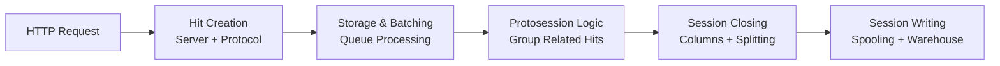
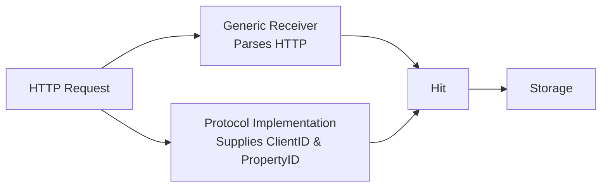
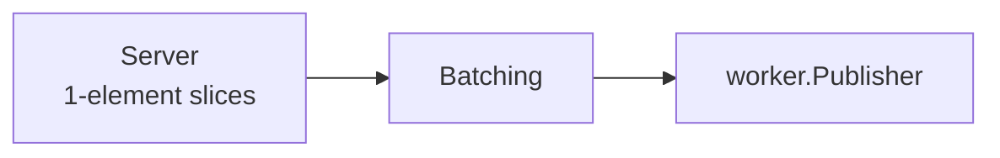
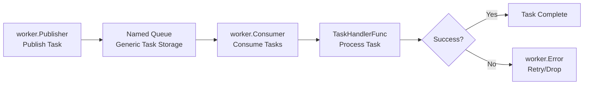
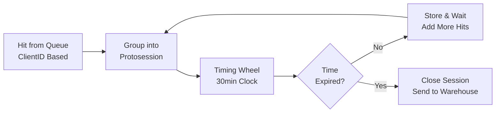
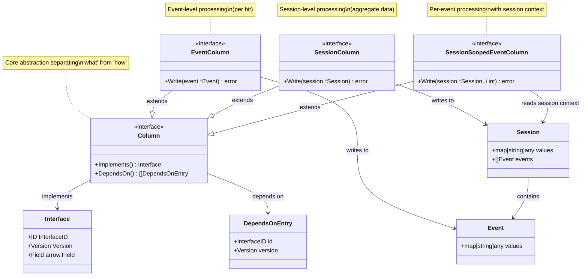
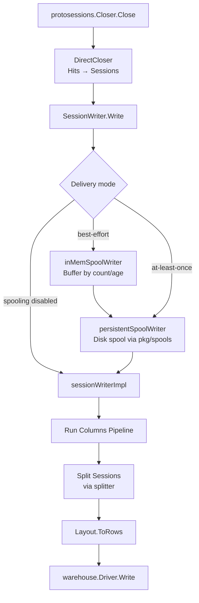
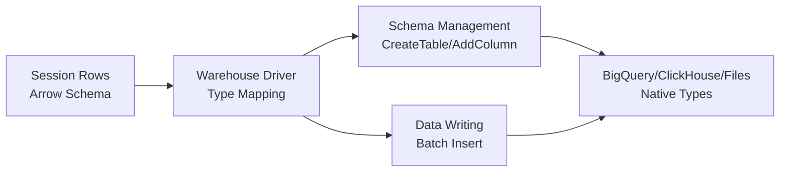

# Technische verdieping

Dit document beschrijft kort de abstracties en mechanismen die in de d8a-tracker worden gebruikt. Het is geschikt als ontwikkelresource en kan ook door een LLM worden gebruikt om een beter begrip van het landschap te krijgen.


## Package-indeling

De belangrijkste packages en abstracties van het tracker-project:

- `pkg/receiver` - ontvangt hits van het HTTP-endpoint en plaatst ze als taken in de message queue
- `pkg/protosessions` - leest taken uit de queue en groepeert hits in proto-sessions, sluit ze vervolgens af tot sessions
- `pkg/sessions` - verzorgt het afsluiten van sessions, kolomverwerking, spooling en het schrijven naar het warehouse
- `pkg/columns` en `pkg/schema` - kolomdefinities (interfaces) en kolomimplementaties (hoe waarden worden berekend en geschreven)
- `pkg/warehouse` - biedt abstracties voor het schrijven van data naar verschillende data warehouses
- `pkg/splitter` - splitst en filtert sessions op basis van configureerbare voorwaarden (UTM-wijziging, user ID-wijziging, max. events, tijdslimiet)
- `pkg/spools` - crash-veilige, keyed framed-file append+flush-primitive die wordt gebruikt voor persistente session-spooling

Overige, hulppackages:

- `pkg/cmd` - parsen van command line-argumenten, laden van configuratie en de volledige pipeline-bedrading
- `pkg/worker` - abstracties voor de queue-logica (publisher, consumer, task, worker, middleware)
- `pkg/bolt` - BoltDB-backed implementaties voor KV-, set- en proto-session-I/O-primitieven
- `pkg/storage` - generieke KV- en set-storage-interfaces met in-memory- en monitoring-implementaties
- `pkg/protocol` - abstracties en implementaties van tracking-protocollen (GA4, Matomo, D8A)
- `pkg/properties` - registry en configuratie van property-instellingen
- `pkg/hits` - kern-`Hit`-datastructuur die een enkel trackingverzoek representeert
- `pkg/encoding` - pluggable encoder/decoder-functieparen (CBOR+zlib, JSON, gzip+JSON, gob)
- `pkg/storagepublisher` - dunne adapter die een batch hits serialiseert tot een worker-taak en deze publiceert


## De essentie




De tracking-pipeline ziet er in essentie als volgt uit:

1. Het HTTP-verzoek met de getrackte data wordt ontvangen door de `receiver`-package. Deze bevat mappings van het HTTP-pad naar een specifieke `protocol.Protocol`-implementatie (zoals GA4, Matomo, enz.). Het protocol helpt de `receiver` om een `hits.Hit`-object te maken. Dat is een zeer dunne wrapper rond een http-verzoek, met enkele aanvullende attributen die essentieel zijn voor latere verwerking (`ClientID`, `PropertyID`) en het aanmaken van sessions.

2. Nadat een hit is aangemaakt, wordt deze doorgegeven aan een implementatie van de `receiver.Storage`-interface. Het is een zeer eenvoudige interface die simpelweg een hit accepteert en opslaat. Onder de motorkap is er een batcher die hits buffert en ze naar een generieke queue duwt (een `worker.Publisher`-implementatie).

3. Aan de andere kant leest een `worker.Consumer`-implementatie de taken, en een `worker.TaskHandler` deserialiseert de generieke bytes terug naar `hits.Hit`-objecten. De protosession-logica treedt in werking.

4. Een protosession is een verzameling hits die in de toekomst een session kan vormen. Het is heel goed mogelijk dat een verzameling hits in meerdere sessions wordt gesplitst. De logica in `protosessions` groepeert in essentie de potentieel gerelateerde hits in één verzameling. Wanneer een bepaalde tijdsperiode sinds de laatst toegevoegde hit aan een gegeven protosession is verstreken, wordt de protosession afgesloten via een `protosessions.Closer`-implementatie.

5. De `sessions`-package verzorgt het afsluiten. `DirectCloser` zet proto-sessions (groepen van `*hits.Hit`) om in `schema.Session`-objecten en delegeert naar een `SessionWriter`. De writer draait de kolommenmachinerie, splitst sessions via de `splitter`-package, zet de resultaten om in rijen via een `Layout` en schrijft ze naar het warehouse. De writer kan worden gedecoreerd met spooling-lagen (`inMemSpoolWriter` voor in-memory buffering, `persistentSpoolWriter` voor crash-veilige disk-spooling via `pkg/spools`) vóór de daadwerkelijke schrijfactie naar het warehouse.

6. Nadat de kolommenmachinerie rijen voor specifieke tabellen heeft gemaakt, schrijft ze deze naar een `warehouse.Driver`-implementatie. De kolomtypes worden in de kolommenmachinerie gedefinieerd met Apache Arrow-types; de drivers zijn verantwoordelijk voor het toewijzen daarvan aan hun native types.

## 1. Hit creation



Alles begint in de `receiver`-package. Het is een HTTP-server die verzoeken ontvangt en `hits.Hit`-objecten aanmaakt. Hij is momenteel geïmplementeerd in `fasthttp`, maar is zeer losjes gekoppeld aan de onderliggende HTTP-server.

Het hoofddoel van de `receiver`-package is om voor elk binnenkomend verzoek een `hits.Hit`-object te maken en dit zo snel mogelijk door te geven aan een persistente storage, zodat het niet verloren gaat.

De Hit-structuur ziet er ongeveer zo uit:

```go
type Hit struct {	
	ID                 string            `cbor:"i"`
	ClientID           ClientID          `cbor:"ci"`
	PropertyID         string            `cbor:"pi"`

	IP                 string            `cbor:"ip"`
	Host               string            `cbor:"h"`
	ServerReceivedTime string            `cbor:"srt"`
	QueryParams        url.Values        `cbor:"qp"`
	BodyBase64         string            `cbor:"bd"`
  // Other HTTP-related fields
}
```

In feite wikkelt het alle velden van het HTTP-verzoek in, met wat aanvullende info die bruikbaar is voor de volgende pipeline-stappen, namelijk:

* `ClientID`, die uitgebreid wordt beschreven in [identifiers](/nl/articles/glossary). In essentie is het een unieke, (op zichzelf) anonieme identifier van een client, opgeslagen aan de clientzijde (bijvoorbeeld met cookies) en gebruikt om de client over meerdere verzoeken heen te identificeren. De `ClientID` wordt later gebruikt om individuele hits in proto-sessions te verbinden en ook voor partitionering (in d8a cloud).
* `PropertyID`, een unieke identifier van een property, zoals GA4 die opvat. Andere protocollen zijn gedwongen de GA4-nomenclatuur te gebruiken, maar mogen de analoge identifiers in dit veld opslaan (zoals `Matomo` dat `idSite` gebruikt). Latere pipeline-stappen gebruiken de `PropertyID` in hun configuratie om de entiteiten op te halen die voor een gegeven property kunnen worden geconfigureerd, zoals:
	* tabelindeling (één samengevoegde tabel of aparte tabellen voor sessions en events)
	* tabelkolommen
	* bestemmingswarehouse

De twee bovenstaande zijn uiteraard protocolspecifiek; daarom delegeert de `receiver` het parsen van het HTTP-verzoek bij het aanmaken hiervan aan de respectievelijke `protocol.Protocol`-implementatie.

### Belangrijkste interfaces

**`protocol.Protocol`** - definieert een implementatie van een tracking-protocol (GA4, Matomo, D8A). Parseert HTTP-verzoeken tot hits en levert protocolspecifieke kolommen en endpoints.
- `ga4Protocol` - GA4-compatibel protocol dat Google Analytics 4 Measurement Protocol-verzoeken parseert
- `matomoProtocol` - Matomo/Piwik-protocol dat enkelvoudige en bulk-trackingverzoeken parseert
- `d8aProtocol` - D8A-native protocol dat GA4 omhult met herschreven endpoints en interface-ID's

**`protocol.Registry`** - bepaalt het juiste `Protocol` voor een gegeven property ID.
- `staticProtocolRegistry` - map-gebaseerde registry met een standaard protocol-fallback

**`protocol.PropertyIDExtractor`** - haalt de property ID uit een geparseerd verzoek.
- `fromTidByMeasurementIDExtractor` - haalt deze uit de GA4-queryparameter `tid`
- `fromIDSiteExtractor` - haalt deze uit de Matomo-queryparameter `idsite`

**`receiver.HitValidatingRule`** - validatiestrategie voor binnenkomende hits; regels zijn samen te stellen.
- `multipleHitValidatingRule` - samengestelde regel die alle onderliggende regels draait en fouten samenvoegt
- `simpleHitValidatingRule` - wikkelt een gewone functie in als validatieregel
- Vooraf gebouwde regels: `ClientIDNotEmpty`, `PropertyIDNotEmpty`, `HitHeadersNotEmpty`, `EventNameNotEmpty`, `TotalHitSizeDoesNotExceed(max)`, enz.

**`receiver.RawLogStorage`** - optioneel side-channel voor het opslaan van ruwe verzoeken vóór de hit-conversie (debugging/auditing).
- `NoopRawLogStorage` - verwerpt alle data

**`properties.SettingsRegistry`** - zoekt property-configuratie op via measurement ID of property ID.
- `StaticSettingsRegistry` - statische in-memory registry, gebaseerd op twee maps met optionele standaard-fallback

## 2. Receiver storage & batching



Alle hits in de `server`-package worden gebatcht en doorgegeven aan een `receiver.Storage`-implementatie. 

```go
// Storage is a storage interface for storing hits
type Storage interface {
	Push([]*hits.Hit) error
}
```

In theorie kan het elke storage zijn, wat veel flexibiliteit biedt in toekomstige configuraties. Momenteel worden alle doorgegeven hits gebatcht en doorgegeven aan een `worker.Publisher`-implementatie. Dit betekent dat je zoveel `receivers` kunt hebben als je wilt, maar aan de andere kant van de queue (`worker.Consumer`) heb je slechts één instantie.

### Belangrijkste interfaces

**`receiver.Storage`** - kernabstractie voor het persisteren/doorsturen van hits nadat ze zijn ontvangen.
- `BatchingStorage` - verzamelt hits in een `BatchingBackend` en flusht naar een onderliggende `Storage` bij het bereiken van een batchgrootte- of timeout-drempel
- `storagepublisher.Adapter` - serialiseert hits tot een `worker.Task` en publiceert ze via een `worker.Publisher` (productie-onderliggende storage)
- `dropToStdoutStorage` - schrijft elke hit als pretty-printed JSON naar stdout (debug)

**`receiver.BatchingBackend`** - pluggable persistentielaag voor het stagen van hits tussen aankomst en flush.
- `memoryBatchingBackend` - in-memory slice, wordt geleegd na flush (standaard)
- `fileBatchingBackend` - duurzame staging naar schijf via een append-only framed-JSON-bestand

## 3. Queue processing



De voor `tracker-api` geïmplementeerde queue is generiek en kan in latere stappen worden gebruikt (bijvoorbeeld nadat een session is afgesloten en vóórdat deze naar het warehouse wordt geschreven - dat is momenteel niet zo - voor snellere MVP-levering). Hij is geïmplementeerd in de `worker`-package.

De semantiek is doodeenvoudig - je publiceert naar een named queue die slechts één type taak accepteert, en iets aan de andere kant consumeert het. Er zijn geen geavanceerde features zoals AMQP's bindings, exponential backoff en dergelijke. Zo'n doodeenvoudige aanpak is beperkend, maar biedt een breed scala aan mogelijke implementaties (momenteel hebben we filesystem- en object storage-implementaties). De interfaces zijn opnieuw heel eenvoudig. Er zijn twee interfaces die werken op `Task`-objecten die werkelijk generiek zijn:

```go
// Consumer defines an interface for task consumers
type Consumer interface {
	Consume(handler TaskHandlerFunc) error
}

// TaskHandlerFunc is a function that handles a task
type TaskHandlerFunc func(task *Task) error

// Task represents a unit of work with type, headers and data
type Task struct {
	Type    string
	Headers map[string]string
	Body    []byte
}

// Publisher defines an interface for task publishers that can publish tasks
type Publisher interface {
	Publish(task *Task) error
}
```

En daar bovenop is er een `worker.Worker`-struct die helpt bij het toewijzen van taaktypes aan gegeven queues, met behulp van generics - het unmarshalt automatisch de taak-body en geeft deze met het juiste type door aan de respectievelijke handler.

```go

w := worker.NewWorker(
	[]worker.TaskHandler{
		worker.NewGenericTaskHandler(
			hits.HitProcessingTaskName,
			encoding.ZlibCBORDecoder,
			func(headers map[string]string, data *hits.Hit) *worker.Error {
				// Process the hit, return specific (retryable or droppable) error
				return nil
			},
		),
	},
	[]worker.Middleware{
		// middleware using the headers, used for partitioning and such
	},
)
```

### Belangrijkste interfaces

**`worker.Publisher`** - publiceert een enkele taak naar een queue.
- `FilesystemDirectoryPublisher` - schrijft taken atomair naar getimestampte `.task`-bestanden in een directory
- `objectstorage.Publisher` - uploadt geserialiseerde taken naar een object storage-bucket via Go CDK
- `monitoringPublisher` - decorator die OpenTelemetry-metrieken registreert en vervolgens delegeert

**`worker.Consumer`** - consumeert taken uit een queue via een handler-callback.
- `FilesystemDirectoryConsumer` - poll't een directory op `.task`-bestanden en verwerkt ze in timestamp-volgorde
- `objectstorage.Consumer` - poll't een object storage-bucket op taakobjecten via Go CDK

**`worker.Middleware`** - omhult taakverwerking met een next-chain-patroon (vergelijkbaar met HTTP-middleware).
- Momenteel geen productie-implementaties in de kernpackages

**`worker.TaskHandler`** - handler voor een specifiek taaktype.
- `genericTaskHandler[T]` - type-geparametriseerde handler die de body decodeert naar `T` en een getypeerde processor aanroept

**`worker.MessageFormat`** - serialisatie/deserialisatie van `*Task` van/naar `[]byte`.
- `binaryMessageFormat` - binair wire-formaat met type-length-prefix, JSON-gecodeerde headers en ruwe body

## 4. Protosession logic



Er is een specifieke handler voor taken die `hits.Hit`-objecten bevatten. Deze is geïmplementeerd in de `protosessions`-package - de functie `protosessions.Handler` maakt hem aan. Hier komen we het hoofdprincipe van dit ontwerp tegen:

:::warning
	Opeenvolgende hits die tot dezelfde proto-sessions behoren, **moeten** door dezelfde worker worden verwerkt.
:::

Het hangt samen met de werking van de session-afsluitlogica. Voor elke `ClientID` houdt de `protosessions.Handler` een klok bij. Als er 30 minuten (configureerbaar) zijn verstreken sinds de laatst toegevoegde hit aan de proto-session, wordt de session afgesloten.

Dit is geïmplementeerd met een concept dat losjes is gebaseerd op [timing wheels](https://zbysiu.dev/til/hierarchical-timing-wheels/). Elke seconde wordt een `tick` uitgezonden die controleert of er voor die seconde proto-sessions klaar zijn om te worden afgesloten. Een gedetailleerdere beschrijving staat in de code zelf, in het bestand `protosessions/trigger.go`.

De huidige implementatie staat niet toe dat een enkele proto-session door meerdere workers wordt verwerkt, vandaar de bovenstaande eis. Vanwege deze eigenschap hebben we partitionering in d8a cloud geïntroduceerd.

De `protosessions`-package verzorgt ook wat dynamische logica via de `protosessions.Middleware`-interface:

* **Evicting** - een proto-session kan uit een gegeven worker worden geëvicteerd als het systeem detecteert dat deze met een andere proto-session zou moeten worden verbonden. Dit kan bijvoorbeeld gebeuren als het systeem detecteert dat twee proto-sessions van hetzelfde apparaat komen (dezelfde session stamp hebben). Dat kan betekenen dat de gebruiker cookies heeft verwijderd of een andere browser heeft gebruikt, en dat twee proto-sessions voorlopig tot één worden samengevoegd.
* **Compaction** - alle informatie over proto-sessions wordt opgeslagen in eenvoudige en generieke datastructuren - `storage.Set`- en `storage.KV`-implementaties (momenteel `bolt`). Als een - toekomstige - `storage.Set` of `storage.KV` geheugenbeperkt is (bijvoorbeeld Redis), kan het gebeuren dat het systeem zelfs binnen het venster van 30 minuten te veel proto-sessions heeft om te verwerken. Om dat te voorkomen berekent `protosessions` de grootte van elke proto-session en compacteert deze als hij te groot is. Momenteel gebeurt de compactie in-place, door ruwe hits te vervangen door gecomprimeerde in dezelfde `storage.Set`. Niettemin zijn de interfaces al zo opgezet dat het mogelijk is om gelaagde storage toe te voegen, wat een efficiëntere compactie mogelijk zou maken (bijvoorbeeld door gecomprimeerde proto-sessions op te slaan in een aparte `storage.Set` die door Object Storage wordt ondersteund).

Het afsluiten van protosessions gebeurt via de `protosessions.Closer`-interface. 

```go
// Closer defines an interface for closing and processing hit sessions
type Closer interface {
	Close(protosession [][]*hits.Hit) error
}
```

Hij is voorbereid op asynchroon afsluiten, waarbij het in [Queue Processing](#3-queue-processing) beschreven taaksysteem wordt gebruikt. Momenteel gebeurt het afsluiten in-place: de `Close`-methode schrijft de session synchroon naar het warehouse. Dat is niet perfect, maar voorlopig een goed compromis.

### Belangrijkste interfaces

**`protosessions.Closer`** - verwerkt en sluit proto-sessions af (groepen hits die een session vormen).
- `shardingCloser` - verdeelt batches proto-sessions over N onderliggende closers via FNV-hash-gebaseerde sharding op de geïsoleerde client ID
- `sessions.DirectCloser` - zet proto-sessions om in `schema.Session`-objecten, groepeert per property en schrijft ze naar een `SessionWriter` (productie-closer)
- `printingCloser` - logt elke hit naar stdout voor debugging

**`protosessions.BatchedIOBackend`** - gebatchte I/O voor proto-session-storage (detectie van identifier-conflicten, hit append/get, het markeren van timing-wheel-buckets, opschonen).
- `bolt.boltBatchedIOBackend` - BoltDB-backed backend met in-memory session-naar-bucket-cache; alle operaties draaien in enkele transacties
- `deduplicatingBatchedIOBackend` - decorator die identieke verzoeken dedupliceert voordat ze worden doorgestuurd

**`protosessions.TimingWheelStateBackend`** - persistentie voor de cursorpositie van het timing wheel.
- `genericKVTimingWheelBackend` - slaat de bucket-status op in een `storage.KV` onder een geprefixte sleutel

**`protosessions.IdentifierIsolationGuardFactory`** / **`IdentifierIsolationGuard`** - garandeert cross-property data-isolatie door client ID's met de property ID te hashen.
- `defaultIdentifierIsolationFactory` / `defaultIdentifierIsolationGuard` - SHA-256-hasht client ID's met de property ID voor isolatie
- `noIsolationFactory` / `noIsolationGuard` - geeft ID's ongewijzigd terug, geen isolatie (alleen single-tenant)

**`storage.KV`** - eenvoudige key-value store-abstractie.
- `bolt.boltKV` - BoltDB-backed persistente KV-store
- `storage.InMemoryKV` - in-memory, map-gebaseerde KV met RWMutex
- `monitoringKV` - decorator die OpenTelemetry-latency-histogrammen registreert

**`storage.Set`** - set-of-values-per-key-storage.
- `bolt.boltSet` - BoltDB-backed persistente set met geneste buckets
- `storage.InMemorySet` - in-memory map-of-sets
- `monitoringSet` - decorator die OpenTelemetry-latency-histogrammen registreert

### 4.1 Isolation

Het isolatiemechanisme zorgt ervoor dat proto-sessions van verschillende properties gescheiden blijven, zelfs wanneer ze dezelfde client-identifiers delen. Zonder isolatie zouden gebruikers van verschillende properties onder bepaalde omstandigheden hun hits ten onrechte in één enkele proto-session gegroepeerd kunnen krijgen.

De isolatie is geïmplementeerd via de `IdentifierIsolationGuard`-interface, die drie belangrijke mogelijkheden biedt:

```go
type IdentifierIsolationGuardFactory interface {
	New(settings *properties.Settings) IdentifierIsolationGuard
}

type IdentifierIsolationGuard interface {
	IsolatedClientID(hit *hits.Hit) hits.ClientID
	IsolatedSessionStamp(hit *hits.Hit) string
	IsolatedUserID(hit *hits.Hit) string
}
```

De `IsolatedClientID`-methode transformeert de `AuthoritativeClientID` die voor storage-sleutels wordt gebruikt, zodat dezelfde client ID van verschillende properties resulteert in verschillende geïsoleerde identifiers. De standaardimplementatie hasht de property ID samen met de Client ID.

De `IsolatedSessionStamp`-methode produceert property-scoped session stamps, en `IsolatedUserID` doet hetzelfde, maar voor de user ID.


## 5. Columns machinery

### 5.1 Columns



De kolommenmachinerie is vrij complex en biedt de volgende mogelijkheden:

* De mogelijkheid om een kolom-"Interface" (`schema.Interface`) te definiëren, een struct die de kolom beschrijft: 
	* Kolom-id (te gebruiken in het dependency-systeem)
	* Kolomversie (idem)
	* Kolomnaam
	* Kolomtype
* De mogelijkheid om afzonderlijk het gedrag te definiëren dat data uit een gegeven hit naar deze kolom schrijft.
	* `Write`-methode
	* Aparte interfaces voor `Event`-, `Session`- en `SessionScopedEvent`-kolommen

Dit ontkoppelt het concept van
	* Wat de kolomnaam is en wat hij opslaat
	* En hoe hij uit een gegeven hit wordt geschreven

Dit stelt ons in staat om de kerninterfaces centraal te definiëren in `columns/core.go` en sommige daarvan vervolgens te implementeren in de respectievelijke `protocol`-implementaties.

```go
type Interface struct {
	ID      InterfaceID
	Version Version
	Field   *arrow.Field
}

// Column represents a column with metadata and dependencies.
type Column interface {
	Implements() Interface
	DependsOn() []DependsOnEntry
}

// EventColumn represents a column that can be written to during event processing.
type EventColumn interface {
	Column
	Write(event *Event) error  // Event is a simple struct with map[string]any to write values to
}

// SessionColumn represents a column that can be written to during session processing.
type SessionColumn interface {
	Column
	Write(session *Session) error // As Event, but also has the collection of all the events in the session as a separate field (only for reading)
}

// SessionScopedEventColumn represents a column that writes per-event values with session-wide context.
type SessionScopedEventColumn interface {
	Column
	Write(session *Session, i int) error // Takes the session and event index
}

```

Het maakt ook parallelle implementaties voor dezelfde kolominterface mogelijk, bijvoorbeeld als betaalde extra's (concurrerende geoip-implementaties - we hoeven niet te kiezen tussen MaxMind of DbIP - we kunnen beide gebruiken en de gebruiker laten beslissen welke hij gebruikt).

De meeste kolomimplementaties bevinden zich in de packages `columns/eventcolumns` en `columns/sessioncolumns`, sommige zijn verspreid over `protocol`-implementaties. De algemene interfaces staan in de `columns`-package.

Het grootste deel van de machinerie zelf is geïmplementeerd in de `sessions`-package, zowel de `Closer`-implementatie als de hulpmiddelen om alles samen te voegen.

### Belangrijkste interfaces

**`schema.Column`** (basis) / **`schema.EventColumn`** / **`schema.SessionColumn`** / **`schema.SessionScopedEventColumn`** - de drie kolomtypes.
- `simpleEventColumn` - generieke event-kolom; geconstrueerd via `NewSimpleEventColumn`, `FromQueryParamEventColumn`, `URLElementColumn`, `AlwaysNilEventColumn`, enz.
- `simpleSessionColumn` - generieke session-kolom; geconstrueerd via `NewSimpleSessionColumn`, `FromQueryParamSessionColumn`, `NthEventMatchingPredicateValueColumn`, enz.
- `simpleSessionScopedEventColumn` - generieke session-scoped event-kolom; geconstrueerd via `NewSimpleSessionScopedEventColumn`, `NewValueTransitionColumn`, `NewFirstLastMatchingEventColumn`, enz.

**`schema.ColumnsRegistry`** - bepaalt de volledige set kolommen voor een gegeven property ID.
- `staticColumnsRegistry` - wijst property ID's toe aan kolommen met een standaard-fallback
- `merger` - voegt meerdere `ColumnsRegistry`-instanties samen en sorteert het resultaat topologisch

**`schema.OrderKeeper`** - bepaalt de outputvolgorde van kolommen voor stabiele Arrow-schema's.
- `InterfaceOrdering` - leidt de volgorde af uit de veldposities van de Go-struct
- `noParticicularOrderKeeper` - wijst de volgorde toe in volgorde van eerste voorkomen (voor tests)

**`schema.D8AColumnWriteError`** - foutinterface voor kolomschrijfoperaties met retry-semantiek.
- `BrokenSessionError` - niet-herhaalbaar, markeert de session als broken
- `BrokenEventError` - niet-herhaalbaar, markeert het event als broken
- `RetryableError` - herhaalbaar, de pipeline probeert de hele batch opnieuw

**Noemenswaardige vooraf gebouwde kolommen:**
- Event: `EventIDColumn`, `EventNameColumn`, `ClientIDColumn`, `UserIDColumn`, `IPAddressColumn`, UTM-kolommen, click ID-kolommen, device-kolommen (dd2-gebaseerd)
- Session: `SessionIDColumn`, `DurationColumn`, `TotalEventsColumn`, `ReferrerColumn`, `SplitCauseColumn`, source/medium/term-kolommen
- Session-scoped event: `SSESessionHitNumber`, `SSESessionPageNumber`, `SSETrafficFilterName`

**`columns.SourceMediumTermDetector`** - detecteert de source, medium en term van een session uit events.
- `compositeSourceMediumTermDetector` - draait een keten van onderliggende detectors in prioriteitsvolgorde
- `directSourceMediumTermDetector` - geeft `(direct) / none` terug wanneer er geen referrer is
- `pageLocationParamsDetector` - detecteert op basis van URL-queryparameters (gclid, fbclid, enz.)
- `searchEngineDetector` - matcht de referrer tegen de zoekmachine-database
- `socialsDetector` - matcht de referrer tegen de database van sociale netwerken
- `aiDetector` - matcht de referrer tegen de database van AI-tools
- `videoDetector` - matcht de referrer tegen de database van videosites
- `emailDetector` - matcht de referrer tegen de database van e-mailproviders
- `genericReferralDetector` - fallback: elke referrer-hostnaam wordt `source=hostname / medium=referral`

### 5.2 Tables

Tabellen zijn ook aanpasbaar. Ze worden gedefinieerd met de volgende concepten:

```go
// Layout is the interface for a table layout, implementations take control over
// the final schema and dictate the format of writing the session data to the table.
type Layout interface {
	Tables(columns Columns) []WithName
	ToRows(columns Columns, sessions ...*Session) ([]TableRows, error)
}

// WithName adds a table name to the schema
type WithName struct {
	Schema *arrow.Schema
	Table  string
}

// TableRows are a collection of rows with a table to write them to
type TableRows struct {
	Table string
	Rows  []map[string]any
}
```

In feite vertelt de `Layout`-interface welke tabellen en met welk schema moeten worden aangemaakt, en de `ToRows`-methode neemt de kolommen en sessions en geeft een verzameling rijen terug om naar de gegeven tabellen te schrijven.

**`schema.Layout`** - bepaalt het uiteindelijke schema en dicteert het formaat waarin session-data naar tabellen wordt geschreven.
- `eventsWithEmbeddedSessionColumnsLayout` - single-table-layout die session-kolommen in de events-tabel inbedt met een configureerbaar voorvoegsel
- `batchingLayout` - decorator die rijen van dezelfde tabel samenvoegt tot één batch-entry
- `brokenFilteringLayout` - decorator die broken sessions en events eruit filtert vóór het schrijven

**`schema.LayoutRegistry`** - bepaalt een `Layout` voor een gegeven property ID.
- `staticLayoutRegistry` - wijst property ID's toe aan layouts met een standaard-fallback

## 6. Session closing and writing



Wanneer een protosession wordt afgesloten, zet de `sessions.DirectCloser` proto-sessions (groepen van `*hits.Hit`) om in `*schema.Session`-objecten, groepeert ze per property en delegeert naar een `SessionWriter`.

De `SessionWriter` is samengesteld als een decorator-keten waarvan de vorm afhangt van de delivery-modus:

- **Best-effort (standaard):** `inMemSpoolWriter` → `persistentSpoolWriter` → `sessionWriterImpl`
- **At-least-once:** `persistentSpoolWriter` → `sessionWriterImpl` (geen in-memory buffer; sessions gaan rechtstreeks naar de disk-spool)
- **Spooling uitgeschakeld:** rechtstreeks `sessionWriterImpl`

De spooling-decorators bieden veerkracht:

1. **`inMemSpoolWriter`** - buffert sessions per property in het geheugen en flusht naar de onderliggende writer wanneer een aantaldrempel (`maxSessions`) of een leeftijdsdrempel (`maxAge`) wordt bereikt. Een achtergrond-goroutine veegt periodiek. Bij een flush-fout blijven sessions in de buffer voor een herhaling.

2. **`persistentSpoolWriter`** - codeert sessions via `encoding.EncoderFunc` (standaard Gob), voegt ze toe aan een crash-veilige `spools.Spool` met de property als sleutel, en flusht periodiek via een achtergrond-actor-loop die decodeert en naar de onderliggende writer delegeert. Foutafhandeling (max. opeenvolgende fouten, delete- versus quarantine-strategie) wordt geconfigureerd op de onderliggende `spools.Spool`, niet op de writer zelf.

De kern-`sessionWriterImpl` doet vervolgens:
1. Resolveert per property de warehouse-driver, layout en kolommen (gecached met TTL)
2. Draait event-kolommen (`EventColumn.Write`) voor elk event
3. Splitst sessions via de `splitter`-package
4. Draait session-scoped event-kolommen (`SessionScopedEventColumn.Write`) voor elk event in context
5. Draait session-kolommen (`SessionColumn.Write`) voor elke session
6. Zet om in rijen via `Layout.ToRows`
7. Schrijft rijen parallel naar elke tabel via de `warehouse.Driver`

### Belangrijkste interfaces

**`sessions.SessionWriter`** - kerninterface voor het schrijven van afgesloten sessions door de kolompipeline naar het warehouse.
- `sessionWriterImpl` - de hoofdwriter: resolveert layout/kolommen/warehouse per property, draait kolommen, splitst, zet om in rijen, schrijft naar het warehouse
- `inMemSpoolWriter` - decorator die sessions in het geheugen buffert en flusht bij aantal-/leeftijdsdrempels
- `persistentSpoolWriter` - decorator die sessions naar een disk-spool codeert en periodiek flusht
- `noopWriter` - doet niets (tests)

**`spools.FailureStrategy`** - definieert het gedrag wanneer een spool-bestand het maximum aantal opeenvolgende fouten overschrijdt. Geconfigureerd op de `spools.Spool` via `spools.WithFailureStrategy()`.
- `spools.deleteStrategy` - verwijdert het spool-bestand (best-effort, dataverlies acceptabel)
- `spools.quarantineStrategy` - hernoemt het spool-bestand met een `.quarantine`-suffix (bewaart het voor handmatig herstel)

**`spools.Spool`** - crash-veilige, keyed framed-file append+flush-primitive.
- `fileSpool` - `afero.Fs`-backed implementatie met length-prefixed binaire frames, rename-before-read flush-isolatie en mutex-beschermde concurrent toegang

**`splitter.SessionModifier`** - neemt een session en geeft nul of meer gesplitste/gefilterde sessions terug.
- `splitterImpl` - kern-splitter die een lijst `Condition`s sequentieel tegen events evalueert
- `filterModifier` - filtert events uit een session met gecompileerde expr-lang-expressies
- `MultiModifier` - ketent meerdere modifiers, waarbij de output van de ene de input van de volgende voedt

**`splitter.Condition`** - bepaalt of een session bij een gegeven event moet worden gesplitst.
- `nullableStringColumnValueChangedCondition` - splitst wanneer de waarde van een nullable-string-kolom verandert (UTM, user ID)
- `maxXEventsCondition` - splitst wanneer het aantal events een drempel overschrijdt
- `timeSinceFirstEventCondition` - splitst wanneer de verstreken tijd sinds het eerste event een duur overschrijdt

**`splitter.Registry`** - levert een `SessionModifier` voor een gegeven property ID.
- `fromPropertySettingsRegistry` - bouwt een modifier uit property-instellingen (voorwaarden + optioneel filter)
- `cachingRegistry` - wikkelt een andere registry met een ristretto-TTL-cache
- `staticRegistry` - geeft altijd dezelfde modifier terug, ongeacht de property

## 7. Warehouse



De `warehouse`-package biedt een uniforme interface voor het schrijven van session-data naar verschillende data warehouses. Het abstraheert warehouse-specifieke details weg, terwijl het compatibel blijft met de Apache Arrow-schema's die in de hele kolommenmachinerie worden gebruikt.

### 7.1 Driver interface

De kernabstractie is de `Driver`-interface, die operaties voor tabelbeheer en data-ingestie definieert:

```go
// Driver abstracts data warehouse operations for table management and data ingestion.
// Implementations handle warehouse-specific DDL/DML operations while maintaining
// compatibility with Apache Arrow schemas.
type Driver interface {
	// CreateTable creates a new table with the specified Arrow schema.
	CreateTable(table string, schema *arrow.Schema) error

	// AddColumn adds a new column to an existing table.
	AddColumn(table string, field *arrow.Field) error

	// Write inserts batch data into the specified table.
	Write(ctx context.Context, table string, schema *arrow.Schema, rows []map[string]any) error

	// MissingColumns compares provided schema against existing table structure.
	MissingColumns(table string, schema *arrow.Schema) ([]*arrow.Field, error)

	// Close releases resources held by the driver.
	Close() error
}
```

De `Write`-methode accepteert rijen als `[]map[string]any`, waarbij elke map een rij representeert met kolomnamen als sleutels. Dit formaat wordt geproduceerd door de `Layout.ToRows`-methode uit de kolommenmachinerie.

### 7.2 Type mapping

Warehouse-drivers moeten converteren tussen Apache Arrow-types en warehouse-native types. Dit wordt afgehandeld via de `FieldTypeMapper`-interface:

```go
// FieldTypeMapper provides bidirectional conversion between Arrow types and warehouse-specific types.
type FieldTypeMapper[WHT SpecificWarehouseType] interface {
	ArrowToWarehouse(arrowType ArrowType) (WHT, error)
	WarehouseToArrow(warehouseType WHT) (ArrowType, error)
}
```

Elke relevante warehouse-driver-implementatie (BigQuery, ClickHouse) levert zijn eigen type-mapper die het volgende afhandelt:
- Primitieve types (integers, floats, strings, booleans)
- Complexe types (timestamps, datums, arrays, structs)
- Afhandeling van nullability
- Type-specifieke formattering voor data-invoeging

Het type-mappingsysteem ondersteunt ook compatibiliteitsregels, waardoor bepaalde typeconversies (bijv. INT32 ↔ INT64) als geldig worden beschouwd tijdens schemavergelijkingen.

### 7.3 Schema management

Drivers verzorgen schema-evolutie via drie hoofdoperaties:

1. **CreateTable** - Maakt een nieuwe tabel met het opgegeven Arrow-schema. De driver converteert Arrow-velddefinities naar warehouse-specifieke DDL-statements. Voor SQL-gebaseerde warehouses gebruikt dit de `QueryMapper`-interface om CREATE TABLE-statements te genereren.

2. **AddColumn** - Voegt een nieuwe kolom toe aan een bestaande tabel. Vóór het toevoegen controleert de driver of de kolom al bestaat om fouten te voorkomen. Dit maakt schema-evolutie mogelijk naarmate er nieuwe kolommen aan de kolomdefinities worden toegevoegd.

3. **MissingColumns** - Detecteert schema-drift door het verwachte schema (uit de kolomdefinities) te vergelijken met het werkelijke tabelschema. Dit wordt vóór schrijfacties gebruikt om automatisch ontbrekende kolommen toe te voegen. De methode voert ook typecompatibiliteitscontroles uit om te garanderen dat bestaande kolommen overeenkomen met de verwachte types.

De `FindMissingColumns`-functie biedt gemeenschappelijke logica voor het vergelijken van schema's en handelt zowel ontbrekende kolommen als type-incompatibiliteiten af. Ze gebruikt een `FieldCompatibilityChecker` om te bepalen of bestaande kolommen compatibel zijn met de verwachte types.

### 7.4 Belangrijkste interfaces en implementaties

**`warehouse.Driver`** - de centrale abstractie voor tabel-DDL en data-ingestie.
- `bigQueryTableDriver` - volledige BigQuery-driver met partitionering, streaming insert- of load job-schrijfstrategieën en typecompatibiliteitsregels
- `clickhouseDriver` - volledige ClickHouse-driver met native protocol batch inserts, kolomvolgorde, TTL-cache
- `SpoolDriver` - bestandsgebaseerde driver die rijen via een `Format` naar lokale schijf schrijft, segmenten op grootte/leeftijd verzegelt en via een `Uploader` uploadt
- `noopDriver` - stille no-op, alle methoden geven nil terug
- `consoleDriver` - print rijen als JSON naar stdout, delegeert naar noop
- `loggingDriver` - logt operatiesamenvattingen via logrus en delegeert vervolgens naar een omhulde driver

**`warehouse.Registry`** - zoekt een `Driver` op via property ID.
- `staticDriverRegistry` - geeft dezelfde driver terug voor alle properties (single-tenant deployments)

**`warehouse.QueryMapper`** - genereert warehouse-specifieke SQL-DDL-fragmenten uit Arrow-schema's.
- `clickhouseQueryMapper` - genereert ClickHouse-DDL met configureerbare ENGINE, PARTITION BY, ORDER BY

**`warehouse.FieldTypeMapper[T]`** - bidirectionele Arrow ↔ warehouse-typeconversie (generieke interface).
- BigQuery: 11 mappers die string, int32/64, float32/64, bool, timestamp, date32, arrays, nested en nullable dekken
- ClickHouse: 13 mappers die het bovenstaande dekken plus low-cardinality, nullability-als-default en restricted nested
- `TypeMapperImpl[T]` - composiet-mapper die meerdere mappers ketent en de eerste geslaagde mapping teruggeeft
- `deferredMapper[T]` - lazy proxy om circulaire afhankelijkheden tijdens de constructie te doorbreken

**`warehouse.FieldCompatibilityChecker`** - bepaalt of twee Arrow-velden typecompatibel zijn.
- `bigQueryTableDriver` - controleert compatibiliteit met int32/int64- en float32/float64-soepelheid
- `clickhouseDriver` - soepele scalaire nullability, strikte struct/list-nullability

**`files.Format`** - definieert hoe data naar bestanden wordt geserialiseerd.
- `csvFormat` - schrijft data als CSV met optionele gzip-compressie

**`files.Uploader`** - verzorgt het uploaden van lokale bestanden naar een bestemming.
- `blobUploader` - uploadt naar cloud blob storage via `gocloud.dev/blob` en verwijdert vervolgens de lokale kopie
- `filesystemUploader` - verplaatst bestanden naar een lokale bestemmingsdirectory

**`bigquery.Writer`** - BigQuery-specifieke schrijfstrategie.
- `streamingWriter` - gebruikt de BigQuery streaming insert-API
- `loadJobWriter` - gebruikt BigQuery load jobs met NDJSON (free-tier-compatibel)

### 7.5 Integratie met session closing

Wanneer een protosession wordt afgesloten, gebruikt de `sessions.SessionWriter` de warehouse-registry om de juiste driver voor de property te verkrijgen. Vervolgens:

1. Haalt het de tabelindeling en kolommen voor de property op
2. Verwerkt het sessions via de kolommenmachinerie om rijen te genereren
3. Zet het sessions om in tabelrijen via de `ToRows`-methode van de layout
4. Schrijft het rijen parallel naar elke tabel via de warehouse-driver

De writer verzorgt schema-beheer automatisch - als er kolommen ontbreken, worden ze vóór het schrijven toegevoegd. Dit garandeert dat schemawijzigingen in de kolomdefinities automatisch in de warehouse-tabellen worden weerspiegeld.
